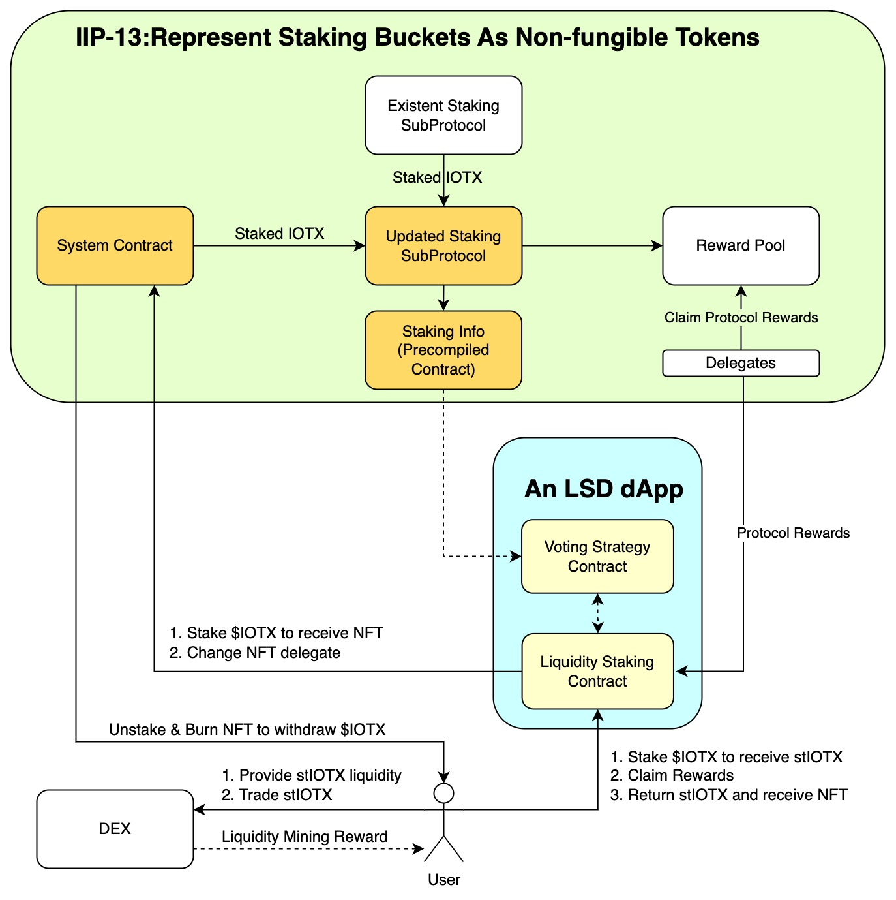
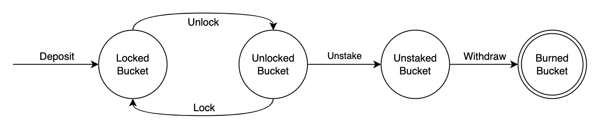

```
IIP: 13
Title: Represent Staking Buckets As Non-fungible Tokens
Author: Seedlet (zhi@iotex.io)
Status: WIP
Type: Standards Track
Category: Core
Created: 2023-02-22
```

## Abstract

This IIP proposes to natively support the representation of staking buckets as Non-fungible Tokens (NFT) on the IoTeX blockchain, which opens opportunities for applications such as Liquid Staking Derivatives (LSD) and potentially increases the staking ratio and therefore enhances the degrees of security and decentralization of the IoTeX blockchain.

## Motivation

The Proof of Stake (PoS) consensus mechanism secures the vast majority of modern blockchains, IoTeX L1 included, as it disincentivizes an attack on the network by requiring control of the majority of coins to control the blockchain. In contrast to the traditional Proof of Work (PoW) consensus mechanism, PoS consensus dramatically reduces the energy required to run a secure and decentralized blockchain. Simply put, the more coins that are staked to govern the protocol, the more secure the blockchain is. Therefore, increasing the total amount of $IOTX staked (i.e., the "staking ratio") has always been the goal for IoTeX.

An interesting primitive called "Liquid Staking" has been introduced by [Lido](
https://lido.fi/static/Lido:Ethereum-Liquid-Staking.pdf) in 2020 which means a liquid staking provider takes coin deposits, stakes those coins, and gives the depositor a receipt that is redeemable for the staked coins. The receipt is a representation of those staked coins that can be traded or used as collateral elsewhere, such as DeFi protocols to be lent, borrowed, or traded. For this reason, liquid staking coins are sometimes referred to as liquid staking derivatives (LSD). Major L1s such as Ethereum, Polygon, Solana, Polkadot, and so on all adopted liquid staking and achieved tremendous success in improving the number of staked coins (and thus the underlying security of the blockchain). However, [staking on IoTeX L1](https://iotex.io/blog/staking-your-iotx-whats-new-a-guide/) is implemented in a native way, which does not support interaction from smart contracts. Hence, popular liquid staking solutions can not be applied directly. 

To better support liquid staking and other innovations at the smart contracts or dApp level, this IIP suggests adding support natively to represent staking buckets as Non-fungible Tokens on the IoTeX blockchain. Therefore, liquid staking solutions, which rely on smart contracts, could manage their stakes in system smart contracts. With this feature implemented and deployed on testnet and mainnet, builders can easily launch their respective liquid staking dApps such as [Lido](https://lido.fi) and [RocketPool](https://rocketpool.net) on IoTeX L1.

## Specification

To support the native representation of staking buckets as NFTs, the high-level intuition is simple: we let users stake via newly-added system contracts to get NFTs, while the updated staking subprotocol on-chain combines the number of staked IOTX from both the existent staking subprotocol and the system contracts introduced.

### The Flow
There are three major components in this proposal: the system contract, the native modification of the staking subprotocol, and a pre-compiled contract to expose delegate and staking info to dApps. The overall flow is listed below where the orange boxes are the new components introduced in this proposal.



### Modification of the Staking Subprotocol
Modification of the staking subprotocol involves a few native changes such as
- Count towards the stakes in the system contract as votes
- Combine the votes in the system contract with the votes in native protocol

Since the main flow will not be changed, limited modifications are needed in staking subprotocol.

### System Contract

System Contract, deployed and managed by gnosis safe, manages a new set of buckets that have the following attributes:
- Auto-staking (aka stake-lock) enabled
- Support a set of bucket types (the amount of IOTX in the bucket and its staking duration), starting with 10,000 IOTX and 30 days 
- After triggering the withdrawal process, NFT is not transferable, and no reward will be distributed.

Three major functions of the system contract are:
1. Create a bucket by staking a fixed amount of IOTX, and receive an NFT representing the bucket
    - Only the NFT owner could update a bucket
    - Buckets could be created in batch
    - Buckets could be updated in batch
2. To withdraw a bucket:
    - Only the NFT owner could withdraw
    - Unlock a bucket
    - Waiting for N days to unstake
    - Signal exit (Unstake) and wait for three days to withdraw
3. The reward will be sent to the NFT owners from the delegates. The dApp that tokenizes NFT into stIOTX tokens will be responsible to implement the voting strategy, e.g., vote for least-ranked delegate, which specific where the staked IOTX to be delegated to.

#### Interfaces
```
function stake(uint256 duration, bytes12 delegate) external payable returns (uint256);
function stake(uint256 amount, uint256 duration, bytes12[] calldata delegates) external payable returns (uint256[] memory);
function unstake(uint256 tokenId) external onlyStakedToken(tokenId) onlyTokenOwner(tokenId);
function unlock(uint256 tokenId) external returns (uint256);
function lock(uint256 tokenId, uint256 duration) external);
function withdraw(uint256 tokenId, address payable recipient) external onlyTokenOwner(tokenId);
function extendDuration(uint256 tokenId, uint256 duration) external onlyLockedToken(tokenId) onlyTokenOwner(tokendId);
function increaseAmount(uint256 tokenId, uint256 amount) external onlyLockedToken(tokenId) onlyTokenOwner(tokendId);
function changeDelegate(uint256 tokenId, bytes12 delegate) external onlyStakedToken(tokenId) onlyTokenOwner(tokenId);
function changeDelegates(uint256[] calldata tokenIds, bytes12 delegate) external;
function emergencyWithdraw(uint256 tokenId, address payable recipient) external;
function emergencyWithdrawPenaltyRate() external view returns (uint256);
function isActiveBucketType(uint256 _amount, uint256 _duration) external view returns (bool);
function numOfBucketTypes() public view returns (uint256);
function bucketTypes(uint256 _offset, uint256 _size) external view returns (BucketType[] memory types_);
function readyToWithdraw(uint256 _tokenId) public view onlyValidToken(_tokenId) returns (bool);
function bucketTypeOf(uint256 _tokenId) external view onlyValidToken(_tokenId) returns (BucketType memory);
function delegateOf(uint256 _tokenId) external view onlyValidToken(_tokenId) returns (bytes12);
function votesTo(bytes12[] calldata _delegates) external view returns (uint256[][] memory counts_);
```

### Pre-compiled Contract To Expose Staking Info
This pre-compiled contract will be responsible to expose staking information such as the number of delegates and who are they, to dApp contracts deployed on the IoTeX blockchain to improve dApps' using experience. This pre-compiled contract will use the address 0x10002.

#### Interfaces
```
function delegates(uint16 _offset, uint16 _size) external view returns (Delegate[]); (function hash 48b4b63d)
function numOfDelegates() external view returns (uint16); (function hash 13c8852e)
function lookup(bytes12 _delegate) external view returns (Delegate); (function hash 77b0a032)
```

### An Example of Liquid Staking dApp
We provide an example of liquid staking dApp [here](https://github.com/iotexproject/iip13-contracts/blob/main/src/LiquidStaking.sol) to demonstrate how it can interact with the system contract. This example dApp can do the following:
- Deposit NFT to receive stIOTX
- The dApp contract deposits IOTX into the system contract to create buckets daily (as the owner of the created bucket)
- The reward will be claimable by the users, and the amount is related to the stIOTX amount
- Deposit stIOTX and receive the NFT back
- Implement a specific voting strategy for the IOTX staked through this dApp

### Reference Implementation
- The system contract and example of a liquid staking contract have been implemented at https://github.com/iotexproject/iip13-contracts.
- The native modification to the staking subprotocol is WIP.

### Rationale
The proposed approach maximizes upgradability, security, and flexibility.
- **Upgradability**: The updated staking subprotocol will make sure new sources of stakes (such as those from the system contract) will be counted in and counted towards specific delegates. It indicates if an upgrade of the system contract is needed, e.g., new features or bug fixes, we can easily deploy system contract v2 and enable the staking subprotocol to count it in.
- **Flexibility**: We acknowledge that the current structure of liquid staking could undergo significant changes in the future, with the possibility of new approaches being developed. To accommodate such innovations, our proposal incorporates an open design that allows
  - the system contract to support staking buckets with various parameters, e.g., X amount of IOTX coins for Y days;
  - and, developers to integrate their own liquid staking contracts as plugins. However, these developers will be fully accountable for ensuring the security and dependability of their respective implementations.
- **Security**:
  - We have minimized the modification to the native staking subprotocol to eliminate unnecessary security risks. This on-chain modification will be thoroughly tested on the devnet and testnet before going live on the mainnet. 
  - Emergency withdrawal interfaces are implemented in the system contract and enable users to urgently withdraw their staked IOTX if needed.
  - We are also considering limiting the total amount of IOTX coins that can be staked in this new way for a period of time before removing this limit. 

### Backward Compatibility
Users who stake via the original staking subprotocol are not affected. The native buckets could be moved to system contract at any time by sending a migration action. A native bucket with amount `a` and duration `d` could be migrated as `n` system contract buckets with amount `a'` and `d'`, if
- The native bucket is not a self-staking bucket.
- The native bucket has not been unstaked.
- `d'` is not smaller than `d`.
- `a' * n = a + diff`, where `diff` is the value ($IOTX) of the migration transaction.
The new bucket in system contract will be an auto-staking bucket.

### Security Considerations
- Once implemented and deployed, we expect this will increase the staking ratio and the security of the IoTeX blockchain.
- The system contract and modification of the native staking subprotocol needs to be audited by third parties and we should publicize the results to ensure security.
- The security of concrete liquid staking dApps is out of the scope of this IIP.

## Copyright

Copyright and related rights waived via [CC0](https://creativecommons.org/publicdomain/zero/1.0/).
