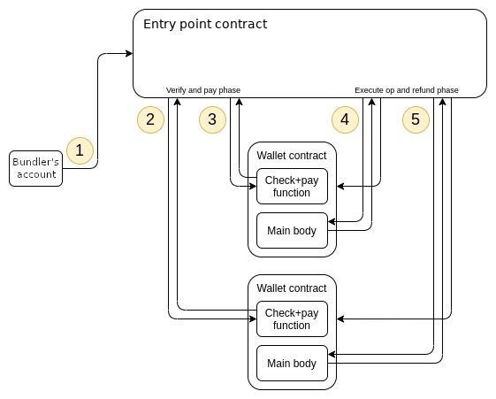
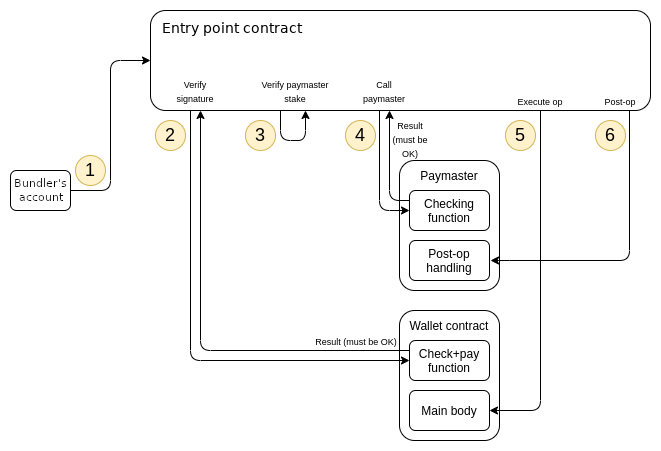

```
IIP: 14
Title: Account Abstraction via EntryPoint Contract
Author: Leo (leo@iotex.io)
Status: WIP
Type: Standards Track
Category: Core
Created: 2023-03-09
```

## Abstract

The EVM-based blockchain account model is based on the concept of Externally Owned Accounts(EOAs) and Contract Accounts. The former is controlled by a private key and is responsible for initiating transactions while the latter represents smart contracts that execute code on the blockchain. Currently, contract accounts depend on EOAs for executing transactions, creating a security vulnerability. The account abstraction proposal completely avoids the need for consensus-layer protocol changes. Instead of adding new protocol features and changing the bottom-layer transaction type, this proposal instead introduces a higher-layer pseudo-transaction object called a `UserOperation`. Users send `UserOperation` objects into a separate mempool. A special class of actors called bundlers (either block builders, or users that can send transactions to block builders through a bundle marketplace) packages up a set of these objects into a transaction, making a handleOps call to a special contract (EntryPoint), and that transaction then gets included in a block.

## Motivation

Account abstraction aims to abstract as many of the account properties as possible, including authentication, authorization, replay protection, gas payment, batching & atomicity, etc. All of these aspects are controlled by the EVM code rather than rigid consensus rules.
This proposal takes a different approach, avoiding any adjustments to the consensus layer. It seeks to achieve the following goals:
- Achieve the key goal of account abstraction

    allow users to use smart contract wallets containing arbitrary verification logic instead of EOAs as their primary account. Completely remove any need at all for users to also have EOAs

- Decentralization

    - Allow any bundler (think: block builder) to participate in the process of including account-abstracted user operations
    - Work with all activity happening over a public mempool; users do not need to know the direct communication addresses (eg. IP, onion) of any specific actors
    - Avoid trust assumptions on bundlers

- Do not require any consensus changes

    Consensus layer changes are harder to implement, require more comprehensive testing, and bear higher risk of deploying. Hence, to increase the chance of faster adoption, this proposal avoids consensus layer changes.

- Try to support other use cases

    - Privacy-preserving applications
    - Atomic multi-operations
    - Pay tx fees with XRC20 tokens, allow developers to pay fees for their users, and sponsored transaction use cases more generally
    - Support aggregated signature (e.g. BLS, Secp256R1)

## Specification

### Definitions

**UserOperation**

A structure that describes a transaction to be sent on behalf of a user. To avoid confusion, it is not named “transaction”.

- Like a transaction, it contains “sender”, “to”, “calldata”, “maxFeePerGas”, “maxPriorityFee”, “signature”, “nonce”

- unlike a transaction, it contains several other fields, described below

- also, the “nonce” and “signature” fields usage is not defined by the protocol, but by each account implementation

**Account Contract**

The account contract for validating and executing user operations.

**Bundler**

A node (block builder) that bundles multiple UserOperations and create an EntryPoint.handleOps() transaction. Note that not all block-builders on the network are required to be bundlers.

**Paymaster**

Paymasters facilitate transaction sponsorship, allowing third-party-designed mechanisms to pay for transactions.

**UserOp Mempool**

An alternate mempool that is used to store unpacked user operations and the bundlers will pick and pack user operations from UserOp mempool.

To avoid consensus layer changes, we do not attempt to create new transaction types for account-abstracted transactions. Instead, users package up the action they want their account to take in an ABI-encoded struct called `UserOperation`:

| Field                   | Type          | Description |
| ----------------------- | ------------- | ----------- |
| sender                  | address       | The account making the operation |
| nonce                   | uint256       | Anti-replay parameter; also used as the salt for first-time account creation |
| initCode                | bytes         | The initCode of the account (needed if and only if the account is not yet on-chain and needs to be created) |
| callData                | bytes         | The data to pass to the sender during the main execution call |
| callGasLimit            | uint256       | The amount of gas to allocate the main execution call |
| verificationGasLimit    | uint256       | The amount of gas to allocate for the verification step |
| preVerificationGas      | uint256       | The amount of gas to pay for to compensate the bundler for pre-verification execution and calldata |
| maxFeePerGas            | uint256       | Maximum fee per gas |
| maxPriorityFeePerGas    | uint256       | Maximum priority fee per gas |
| paymasterAndData        | bytes         | Address of paymaster sponsoring the transaction, followed by extra data to send to the paymaster (empty for self-sponsored transaction) |
| signature               | bytes         | Data passed into the account along with the nonce during the verification step |

Users send UserOperation objects to a dedicated user operation mempool. A specialized class of actors called bundlers (either block builders running special-purpose code, or users that can relay transactions to block builders eg. through a bundle marketplace such as Flashbots that can guarantee next-block-or-never inclusion) listen in on the user operation mempool, and create bundle transactions. A bundle transaction packages up multiple UserOperation objects into a single handleOps call to a pre-published global entry point contract.
To prevent replay attacks (both cross-chain and multiple EntryPoint implementations), the signature should depend on chainId and the EntryPoint address.

The account must follow below rules:
- MUST validate the caller is a trusted EntryPoint
- The userOpHash is a hash over the userOp (except signature), entryPoint and chainId
- If the account does not support signature aggregation, it MUST validate the signature is a valid signature of the userOpHash, and SHOULD return SIG_VALIDATION_FAILED (and not revert) on signature mismatch. Any other error should revert.
- MUST pay the entryPoint (caller) at least the "missingAccountFunds" (which might be zero, in case current account's deposit is high enough)
- The account MAY pay more than this minimum, to cover future transactions (it can always issue withdrawTo to retrieve it)
- The aggregator SHOULD be ignored for accounts that don't use an aggregator
- The return value is packed of sigFailure, validUntil and validAfter timestamps.
    - `sigFailure` is 1 byte value of "1" the signature check failed (should not revert on signature failure, to support estimate)
    - `validUntil` is 8-byte timestamp value, or zero for "infinite". The UserOp is valid only up to this time.
    - `validAfter` is 8-byte timestamp. The UserOp is valid only after this time.



### Paymaster

Paymaster allows users to interact with smart contracts without needing to hold the native currency of the IoTeX network (IOTX) to pay for transaction fees. Instead, a third-party account, known as a "paymaster," would pay the fees on behalf of the user.



## Rationale

With the account abstraction proposal, users no longer make transactions. Instead, they send UserOperations to a higher level mempool. Miners or bundlers can package up a set of UserOperation into a bundle transaction that is sent to the EntryPoint contract for execution. The EntryPoint contract orchestrates the correct execution of the operations and makes sure the miner/bundler is properly compensated for the transaction fee.

## Backwards Compatibility

This proposal does not change the consensus layer, so there are no backward compatibility issues for IoTeX as a whole.

## Reference

[https://eips.ethereum.org/EIPS/eip-4337](https://eips.ethereum.org/EIPS/eip-4337)

## Copyright
Copyright and related rights waived via [CC0](https://creativecommons.org/publicdomain/zero/1.0/).