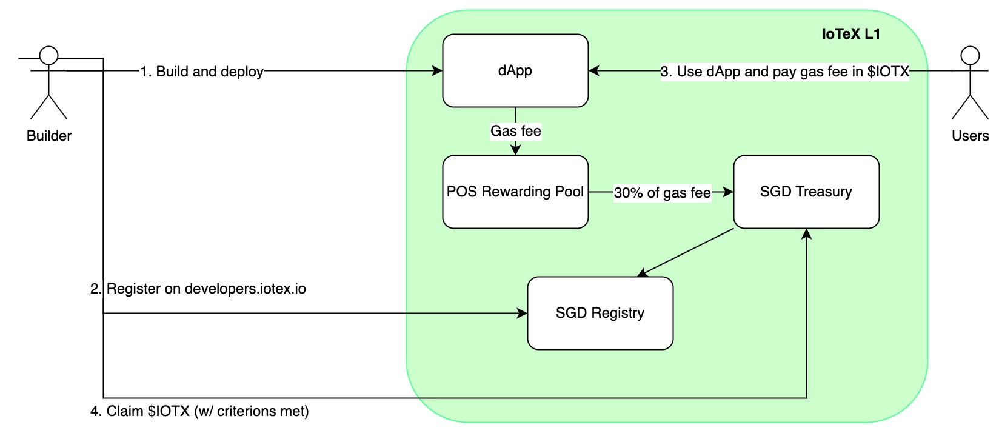

```
IIP: 15
Title: Sharing of Gas-fee with DApps (SGD)
Author: iotex-core
Status: WIP
Type: Standards Track
Category: Core
Created: 2023-03-01
```

## Abstract
This IIP proposes to share part of the transaction gas-fees with DApp developers to promote a vigorous cycle of token economics.

## Motivation
All blockchain platforms thrive through the success of their DApp creators. We should reward high-quality creators on IoTeX in a sustainable way so as to bring more activities to our chain.
Sharing of Gas-fee with DApps, or SGD for short, is an opt-in fee splitting model that revenue-share with the DApp developers a percentage of any transaction gas fee paid to the network when users interact with their dApps on IoTeX. 
To attract and retain quality DApps, and discourage lower quality reward seekers, the IoTeX Foundation will implement a review process for DApps applying to the revenue sharing program. The Foundation will approve DApps based on transaction volume, time deployed on chain and make a final determination. More details below.

## Flow

1. To opt into SGD, developers must first deploy their smart contracts
2. After that, the developers register the DApp contracts on the SGD registry portal by providing the DApp's contract address and the address to receive the reward. It will be a contract call (with the front-end hosted on [https://developers.iotex.io](https://developers.iotex.io), signed by the contracts' deployer address.



3. When users started to use the DApp, gas-fee from those DApp activities accrues gradually and automatically in the SGD treasury every time a transaction is made, as shown in the illustration above. As a good starting point, we advocate that 30% of the gas-fee gets re-allocated to the SGD treasury, while the rest remains in PoS rewarding pool as usual. The actual ratio may be subject to later adjustment by governance voting process.

4. The DApp owner can withdraw this revenue from the SGD treasury by sending a claim action. The SGD treasury will check the SGD registry to verify the eligibility criteria, and issue the reward if criteria are met.

## Components

### SGD Treasury

Treasury is a module in the IoTeX protocol stack that manages the SGD rewarding balance accounting and claiming. Each time an SGD contract is called, the shared gas-fee will be credited to corresponding owner's account. When DApp owner comes to claim the reward, it checks the SGD registry to verify the eligibility criteria, and issues the reward if criteria are met.

### SGD Registry

The registry consists of 2 parts: a system contract and an indexer. 
The system contract is used by DApp owners to register the contract address and reward address (the address they want to receive the reward). After a DApp is deployed, the owner calls this contract to indicate they want to participate in the SGD program, and register the corresponding reward address. The registration will be reviewed and needs to be approved by the IoTeX foundation (see Eligibility Criteria below)
The SGD indexer keeps track of the SGD contract address, its owner (who deployed the contract), and accumulated number of contract calls to the SGD contract. It provides the following functionalities:

1. When a new contract is deployed, the contract address and its owner will be recorded
2. It also keeps track of how many times a contract has been called. Whenever a contract call is made to a contract, it increments that number.
3. Given a contract address, it provides API to query the owner and how many times the contract has been called (something to be considered in the future)

Data provided by SGD indexer will be used to determine whether a contract is eligible to receive SGD reward. See the section below.

### Eligibility Criteria

Without standards or a comprehensive review process, revenue sharing of gas-fee could incentivize spam, clunky DApps, and other gas extraction loopholes. The IoTeX Foundation will review the DApp's registration request, rate its fitness to the program according to the time it has been deployed on the chain, its transaction volumes, and render a final decision as to approve the DApp or not. To kick-start the program, the initial conditions are set as follows. These may be subject to later adjustment by governance voting process.

- Completed a total of 100,000 or more transactions on IoTeX L1
- The DApp has been deployed and running normally for 1 month or above on the IoTeX blockchain
- DApp application reviewed and approved by the IoTeX Foundation

In case the DApp has incurred spam transactions or illegitimate activities (for example, but not limited to, fraud, rug-pull, attempt to attack user's token/fund, gas extraction, etc.), the IoTeX Foundation reserves the right to immediately dis-approve the involved DApp in the SGD program, and blacklist the involved owner/address in future programs.

## Rationale

This feature implementation consists of the following parts:
1. SGD treasury to manage the gas-fee distribution, accounting, and claim process for SGD gas fee
2. SGD registry to handle the SGD contract approval, qualification, and share percentage calculation

And it will be enabled in future hard-fork.

## Backwards Compatibility

This feature will be enabled in the upcoming hard-fork, so backward compatibility is maintained.

## Security Considerations

## Copyright
Copyright and related rights waived via [CC0](https://creativecommons.org/publicdomain/zero/1.0/).