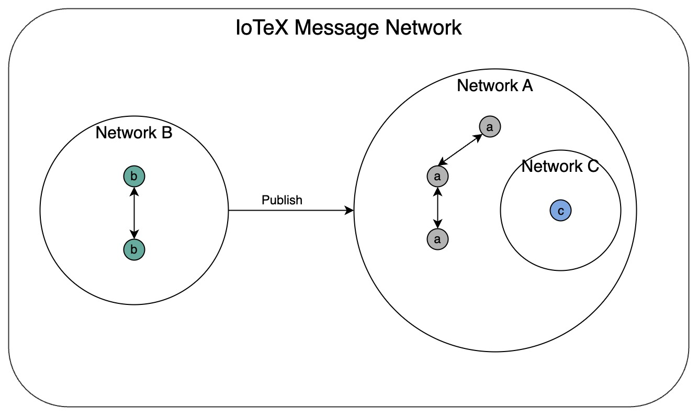

```
IIP: 16
Title: Support Multiple Node Types within IoTeX Network
Author: ChenChen (chenchen@iotex.me)
Status: WIP
Type: Standards Track
Category: Core
Created: 2023-08-02
```

## Abstract

This IIP introduces the concept of node types, aiming to enable a diversified network structure in the future. It discusses the registration process and mechanisms associated with node types. Additionally, it introduces the concept of message networks to optimize communication efficiency among diverse node types. By exploring these advancements, this article seeks to enhance the network's flexibility and scalability.

## Motivation

Currently, the requirements for becoming a delegate node in the IoTeX network are relatively high. To address this, we propose separating the block proposal task from delegate nodes. By delegating this responsibility to a different set of nodes that require a lower staking requirement, more individuals can actively participate in the network and earn rewards. 

In line with our broader vision for the future of IoTeX, we envision a diverse network comprising various types of nodes, each performing specific functions. This includes consensus nodes, block proposal nodes, w3bstream (WS) compute nodes, and more. These nodes will earn rewards based on their respective roles and contributions to the network.

To achieve these objectives, it is crucial to establish a solid infrastructure for managing node role assignments. 

## Specification

### What are Node Types?

A node type refers to a distinct category or role assigned to a node within the IoTeX network. Each node type is designed to fulfill specific functions and contribute to the network. The introduction of node types allows for specialization and efficient allocation of resources, ensuring that different tasks are performed by nodes with the necessary expertise and functionalities. 

### Why do we need new Node Types?

Currently, the IoTeX network relies on delegates to validate blocks and maintain the consensus. However, as the network evolves, we envision the introduction of additional node types to enhance its capabilities and accommodate diverse use cases.

For example, we would like to have oracle nodes that serve as bridges between the blockchain and the real world, transforming real-world data into a usable form in smart contracts. Additionally, there will be bridge nodes that connect nodes from different blockchain networks, allowing users to transfer and exchange assets, information, and value between different blockchain networks. Moreover, there will also be WS nodes capable of receiving data streams from IoT devices and processing, analyzing, and computing on this data.

### How do we support New Node Types?

#### Registration

The registration process plays a vital role in onboarding nodes into the IoTeX network.

##### Register Action Interface

The registration action is used to trigger the registration of node types. Different types of node registrations may require different information, but they need to follow a unified specification. Below are the interface definitions that each type of node registration should comply with.

```go
NodeTypeRegisterAction interface {
        OwnerAddress() address.Address
        OperatorAddress() address.Address
        RewardAddress() address.Address
        Amount() *big.Int
        Duration() uint32
        AutoStake() bool
        CandidateType() uint32
        ExtraData() []byte
}
```

Whereas CandidateType represents the type of registered node. ExtraData is used for the personalized data required for registration of different types of nodes. (For example, delegate node registration requires a name.)

##### Validatation

A valid registration action must meet the following requirements:
- The staking amount must meet the minimum staking requirements
- The same OperatorAddress or OwnerAddress can only register the same node type once.
- The same OperatorAddress can register as different types of nodes.

##### Storage

After successful registration verification, two types of data, NodeType and Staking Bucket, will be stored on blockchain.

NodeType stores the registration information of nodes, and its structure is defined as follows:
```go
NodeType struct {
        Owner              address.Address
        Operator           address.Address
        Reward             address.Address
        Type               uint32
        SelfStakeBucketIdx uint64
        extraData []byte
}

func NodeTypeExtra[T interface{ Deserilized([]byte) error }](c *NodeType, extra T) error {
        return extra.Deserilized(c.extraData)
}
```

SelfStakeBucketIdx represents the index of the corresponding bucket. The personalized data of different node types is stored in extraData, which can be parsed into the corresponding structure for easy access using the NodeTypeExtra method.

The Staking Bucket inherits the native staking bucket from before, and its definition is as follows:
```go
VoteBucket struct {
    Index            uint64
    Candidate        address.Address
    Owner            address.Address
    StakedAmount     *big.Int
    StakedDuration   time.Duration
    CreateTime       time.Time
    StakeStartTime   time.Time
    UnstakeStartTime time.Time
    AutoStake        bool
}
```

For the candidate to be consistent with the owner, it indicates a self-stake bucket. Not all operations on buckets are supported. The detail is as follows (checked means support the operation):
- Unstake: ✅
- Withdraw: ✅
- Restake: ✅
- Deposit: ✅
- ChangeDelegate
- Transfer

##### Retrieve

After completing the registration, you can obtain information on all nodes of a specified type through the staking protocol. The interface is defined as follows:
```go
type Protocol interface{
    NodeTypes(nodeType uint32) []NodeType
}
```

#### Revoke

If a user no longer wishes to continue running as a registered node in the network, they can initiate the exit process at any time.
1. Non-auto-stake: If the bucket's status is set to auto-stake, the user needs to perform a restake operation first to switch the status to non-auto-stake.
2. Waiting staking period: Starting from the moment of non-auto-stake, the user needs to wait for the staking period of the corresponding bucket. During this period, the node's registration type remains effective.
3. Unstake: After the staking period ends, the user can perform an unstake operation. Once completed, the node's registration type becomes invalid.
4. Waiting for 3 days: Starting from the moment of unstake, the user needs to wait for three days.
5. Withdraw: After the waiting period, the user can perform a withdraw operation to retrieve the staked amount.

#### Messaging

Once the registration of nodes is completed, they can operate and perform their respective functions within the network. To facilitate more effective communication among different types of nodes, we introduce the concept of message networks. Message networks possess the following characteristics, optimizing communication and addressing network congestion:
1. Node Message Sending and Receiving: When a node joins a message network, it can send and receive messages within that network. This allows nodes to engage in real-time information exchange with other nodes within the same message network.
2. Isolation of Message Networks: Nodes can send messages to a message network they have not joined, but they are unable to receive messages from that network. This isolation ensures that nodes are only affected by the message network they belong to, preventing interference from other message networks. Different types of nodes can exchange internal messages within their respective message networks without disrupting the operation of other nodes.
3. Joining Multiple Message Networks: Nodes have the capability to join multiple message networks simultaneously. This flexibility allows nodes to participate in appropriate message networks based on their specific communication requirements. By joining the relevant message networks, nodes can engage in targeted message delivery and subscribe to messages from nodes of other types.

##### Architect

Different types of nodes have different roles, which determine the networks they will join and the networks to which they will send messages. The future IoTeX network will consist of various types of nodes. Each type of node will choose to join specific networks and send messages to certain networks, thus forming the overall network structure. This allows each type of node to receive only the content of interest, reducing network load. Below is an example diagram of the network structure:


##### Pubsub

We will implement message networks based on the pubsub system. The main reasons for choosing it are as follows:
1. Seamless Integration: libp2p is a fundamental building block of the IoTeX network, providing a modular and flexible networking layer. Utilizing the pubsub system from libp2p ensures seamless integration with the existing network infrastructure and minimizes code complexity.
2. Robustness and Security: libp2p is designed to be secure and resilient, making it well-suited for decentralized and distributed networks. By leveraging the pubsub system of libp2p, the message networks benefit from the library's robustness and security features, enhancing the overall reliability of the communication mechanism.

Using the pubsub system to implement message networks involves the following steps:
1. Topic Creation:
To create a message network, a node must first define a topic, which serves as the channel for message dissemination within the network. Each message network can have its own unique topic. When a node wants to participate in a specific message network, it subscribes to the corresponding topic.
2. Subscribing to Topics:
Nodes interested in a particular message network subscribe to its topic. Subscribing allows the node to receive messages published to that topic by other participating nodes. When a node joins a message network, it sends a subscription request to the network, informing other nodes of its interest in receiving messages related to that topic.
3. Publishing Messages:
Nodes within the message network can publish messages to the topic they have subscribed to. When a node has relevant information to share with other participants, it can publish a message to the topic, ensuring that all subscribed nodes receive the message. The pubsub system takes care of disseminating the message to all relevant recipients within the message network.
4. Fan-out:
The fan-out feature allows nodes to publish messages to topics even if they have not subscribed to them. This feature is particularly useful when a node needs to disseminate information or broadcast messages to a wider audience within the network. By leveraging the fan-out capability, nodes can reach beyond their subscribed topics and broadcast important messages to other nodes throughout the network.

##### Interface

To join the P2P network and receive messages from specific networks, the creation of the P2P agent needs to include a parameter for the network list. Here is the updated method:
```go
func NewAgent(cfg Config, chainID uint32, genesisHash hash.Hash256, broadcastHandler HandleBroadcastInbound, unicastHandler HandleUnicastInboundAsync, networks []string) Agent
```

To indicate the network for sending messages during the runtime of a node, we can introduce a NetworkProxy to minimize changes to the existing code. The NetworkProxy represents a proxy for a specific network through which messages can be sent. The original Agent will remove the method for sending messages while adding a method for creating a proxy for a specific network. Here is the specific interface definition:
```go
type Agent interface {
    Info() (peer.AddrInfo, error)
    Self() ([]multiaddr.Multiaddr, error)
    BlockPeer(string)
    NetworkProxy(string) NetworkProxy
}

type NetworkProxy interface {
    BroadcastOutbound(ctx context.Context, msg proto.Message) (err error)
    UnicastOutbound(ctx context.Context, peer peer.AddrInfo, msg proto.Message) (err error)
    ConnectedPeers() ([]peer.AddrInfo, error)
}
```

It is worth noting that when creating a NetworkProxy, the selected network does not need to be specified among the networks to be joined during the creation of the Agent. This is because the node can send messages to networks that have not been joined.

#### Incentive

The introduction of multiple node types within the IoTeX network fosters active participation and rewards contributions across various node roles. By incentivizing different types of nodes, the network aims to create a vibrant ecosystem where more participants are motivated to engage and contribute to its growth. The incentives for multiple node types are designed to align with their respective responsibilities and contributions to the network. 

## Rationale

By introducing node type and messaging networks, the IoTeX ecosystem benefits in the following ways:
1. Decentralization and Network Security: By supporting multiple node types, the IoTeX network aims to foster decentralization. Delegating specific tasks to different types of nodes distributes responsibility and authority across a diverse set of participants. This decentralization promotes a more robust and resilient network architecture by reducing the reliance on a single type of node, such as delegates. It enhances network security, mitigates the risk of single points of failure, and ensures that no single entity or group has undue control over the network's operations.
2. Increased Participation: Traditional delegate staking requirements may pose barriers to entry for some individuals or organizations. By diversifying node types and reducing the staking requirements for certain roles, the network becomes more accessible to a broader range of participants. This inclusivity fosters a more vibrant and diverse network ecosystem, attracting a wider community of contributors and stakeholders. Increased participation enhances network resilience, decentralization, and fosters innovation by harnessing a diverse set of skills and perspectives.
3. Future-proofing the Network: As the network expands and new use cases emerge, different types of nodes enable the network to adapt to specific requirements. By having specialized node types, such as proposer nodes for efficient block bundling or w3bstream compute nodes for IoT data processing, the network remains adaptable and capable of handling diverse tasks. This future-proofing ensures that the IoTeX network can scale, evolve, and meet the needs of emerging applications and technologies.

## Backward Compatibility

Ensures backward compatibility by implementing a new registration process separate from the original delegate registration and maintaining a unified message network where all nodes currently reside.

## Security Considerations

### Copyright
Copyright and related rights waived via CC0.