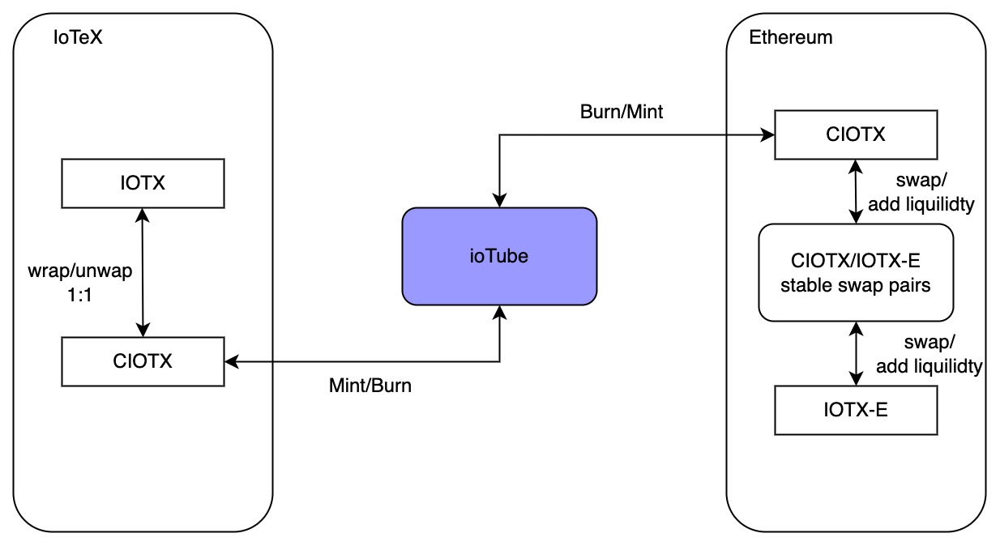

```
IIP: 21
Title: Bridge IOTX from IoTeX to Ethereum
Author: Leo (leo@iotex.io)
Status: WIP
Type: Standards Track
Category: Core
Created: 2023-04-17
```

## Abstract

This proposal outlines a plan to bridge the IOTX coin from IoTeX network to Ethereum and implement CIOTX (Crosschain IOTX) token on Ethereum, with the aim of improving its utilization and demand in DeFi protocols on Ethereum and exchanges.

## Motivation

While IOTX has been successfully bridged to Binance Smart Chain and Polygon using ioTube and used on those chains for over two years, its legacy ERC-20 version, IOTX-E, has limited supply and low circulating availability on Ethereum. This restricts its usage and potential in DeFi protocols on Ethereum, as well as circulating on some centralized exchanges, with listing of IOTX-E, such as Coinbase, Bittrex. Therefore, we propose introducing CIOTX on Ethereum via ioTube bridge. CIOTX will be fully backed by the circulated IOTX on IoTeX network, thus having enough supply for use in any DeFi app on Ethereum and CEX circulating.

## Specification

### Bridge IOTX from IoTeX network to Ethereum using ioTube

CIOTX is a wrapped IOTX on IoTeX network, which can be burnt and minted by ioTube bridge. CIOTX can be burnt on ioTube and minted on Ethereum, thus enabling its circulation on Ethereum. When there is more demand on Ethereum, CIOTX can be bridged from IoTeX network to Ethereum, and when there is more demand on IoTeX network, CIOTX can be bridged back from Ethereum to IoTeX network.

### As a standard ERC-20 token, CIOTX can be used in any protocol on Ethereum

CIOTX can be used in popular DeFi protocols on Ethereum, such as Uniswap, Curve, Aave, Compound, etc.

### Swap between CIOTX and IOTX-E

CIOTX can be paired with IOTX-E on DEX like Uniswap, Curve to allow users to swap between the two at a market price - As CIOTX and IOTX-E may have different values based on demand, they can  possibly be paired on DEX like Uniswap, Curve to allow users to swap between the two tokens at a market price, thus enabling the market to determine their respective prices.



### Easier Listing Process by Centralized Exchanges

Cryptocurrency exchanges that prefer to utilize ERC-20 tokens now have the exciting opportunity to list CIOTX on Ethereum, which is fully backed by native IOTX coin. The listing will be an easy and simple process.

## Conclusion

By implementing this proposal, IoTeX will have a more comprehensive ecosystem of IOTX-backed tokens that can be used across different blockchains, increasing their overall utility and value.

## Backwards Compatibility

There is no backward compatibility concern.

## Security Considerations

There is no security concern.

## Copyright
Copyright and related rights waived via [CC0](https://creativecommons.org/publicdomain/zero/1.0/).
