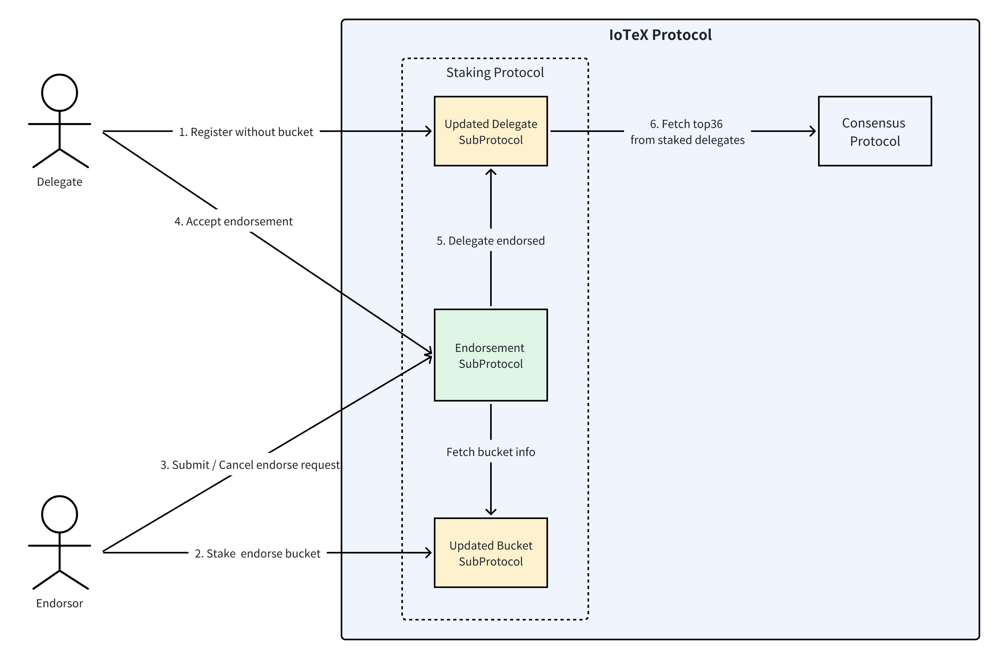
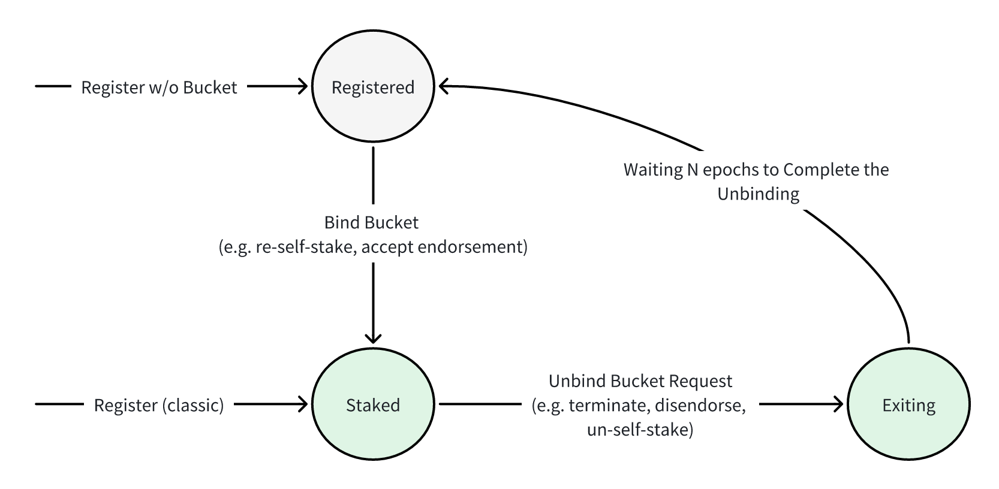
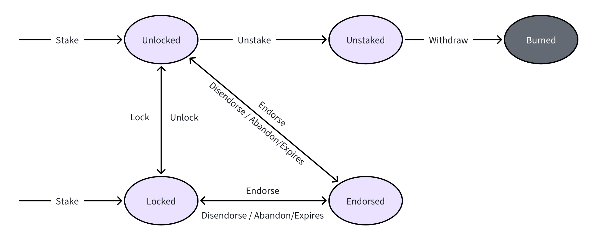

```
IIP: 25
Title: Delegate Endorsement
Author: Chen Chen (chenchen@iotex.me)
Discussions-to: https://community.iotex.io/t/iip-25-delegate-endorsement/11142
Status: Draft
Type: Standards Track
Category: Core
Created: 2023-12-06
```

## Simple Summary
This proposal suggests a system called Delegate Endorsement for the IoTeX Network. It allows individuals to become Delegates without needing to own a large number of tokens.

## Abstract
This proposal introduces Delegate Endorsement, enabling individual stakeholders within the IoTeX Network to become Delegates without owning a substantial amount of tokens (i.e., the current minimum self-stake requirement of 1.2M IOTX). Instead, we propose individuals can accept endorsements from other stakeholders to help meet the minimum self-stake requirement. We believe Delegate endorsement promotes inclusivity and decentralization, expanding participation opportunities and fostering a more fair and accessible IoTeX ecosystem.

## Motivation

The IoTeX network has been built on the principles of decentralization and inclusivity, allowing individuals and entities to actively participate in network consensus as Delegates. In the ecosystem, Delegates are responsible for running the Roll-DPoS consensus protocol to validate network transactions and produce blocks, as well as generate proposals to improve the IoTeX Network. In addition to technical requirements (i.e., maintaining uptime on a powerful hosted server), there are financial requirements to become a Delegate as well, specifically the current requirement of self-staking 1.2M IOTX tokens. This financial requirement has been cited as a barrier for IoTeX stakeholders who want to actively participate in consensus and governance but lack the necessary token holdings.

We propose the implementation of a Delegate Endorsement feature, which would allow stakeholders with substantial holdings to endorse and stake on behalf of aspiring individuals who do not meet the minimum token requirement. This program would enable individuals to actively participate in the network's governance and consensus process, fostering inclusivity and diversity within the IoTeX ecosystem.
## Specification

### Definition
#### Roles
- Delegate: A participant in the system to register without specifying a bucket
  - Oprations:
    - Register without Bucket: The process by which a delegate formally joins the system without designating a specific bucket.
    - Accept Endorse Request: The ability to accept an endorsement request from an endorser.
    - Terminate Endorsement: The action of terminating an existing endorsement.
- Endorser: A participant with the capacity to stake an endorsement bucket and endorse a delegate
  - Operations:
    - Stake Endorse Bucket: The process of staking an endorsement bucket
    - Submit Endorse Request: The act of proposing an endorsement to a specific delegate.
    - Cancel Endorse Request: The ability to cancel a previously submitted endorsement request.
    - Revoke Endorsement: The action of unilaterally terminating an existing endorsement

### Endorse Flow



- Delegate Registration without Bucket:
  - Delegates can register by paying a registration fee of 100 IOTX.
  - Delegates who register without a bucket are not eligible to participate in the consensus process.
  - Each owner/operator address can only register as a delegate once.
- Endorser Stakes and Creates an Endorsement Bucket:
  - Endorsers must stake at least 1.2 million IOTX to create an endorsement bucket.
  - The staking duration for the endorsement bucket can be freely chosen by the endorser.
  - Endorsers have the option to enable auto-staking
  - Endorser can stake multiple endorse buckets
- Endorser Submits Endorse Request
  - The endorser selects an unvoted & unstaked endorsement bucket they own.
  - The endorser determines the endorsement expiration:
    - Delegates can participate in the consensus process until the endorsement expiration.
    - After the expiration, delegates need to obtain new endorsements to continue participating, while endorsers can proceed with a new round of endorsement.
    - The expiration time is not limited to the stake duration of the bucket. Once the bucket is used for endorsement, it cannot be unstaked until the endorsement is terminated.
    - Minimum 90 days
  - Endorsers can only endorse delegates who have not already been endorsed.
  - The bucket becomes endorse-locked after submitting, and can not endorse other delegate
- Endorser Cancels Endorse Request
  - The endorser can cancel the request before it is accepted
  - The bucket becomes endorse-free after cancellation
- Delegate Accepts Endorsement
  - The delegate can accept the endorse request 
  - The bucket is bound to the delegate, can not endorse or unstake until endorsement terminate
  - The delegate is eligible to participate in the consensus process

### Terminate Endorsement
There are three phases about termination:
- Trigger: start the termination process
  - For endorser, there are two options:
    - Expire: once the endorsement starts, it naturally expires after a predefined period
    - Revoke: 
      - Endorsers have the ability to unilaterally propose disendorsing.
      - A one-week protection period is initiated to allow for a smooth transition.
      - During this period, delegates can actively participate in consensus and search for new endorsers.
      - After the protection period ends, the endorsement relationship is terminated.
    - Comparation:
      - Setting an expiration time makes it more stable as it cannot be revoked at will, which benefits both the platform and the delegate.
      - Supports revoking is more flexible for endorsers, although it has a protection period. However, it is relatively unstable for delegates as endorsers can revoke it at any time.
  - For delegates, they have the option to unilaterally terminate their endorsement at will.
  - After one of trigger starts, the termination comes to "Locking" 
- Locking: waiting N epochs to ensure that the assigned task (e.g. Selected as consensus candidate) has been completed and no new tasks will be assigned to it.
  - N >= 2 at least, because it takes a maximum of 2 epochs to remove a delegate from the consensus candidate list.
  - During this period, the bonded bucket can not be unstaked or used to endorse others.
  - After this, the endorsement comes to an end.
- Terminated: 
  - The delegate is no longer eligible to participate in consensus.
  - The delegate becomes endorsable, meaning they can be endorsed by other endorsers.
  - The bucket associated with the delegate is unbound and can be used for another endorsement.

### Rewards

1. Rewards are obtained from the same sources as traditional delegates, which include block rewards, foundation bonuses, and epoch bonuses.
2. The distribution of rewards is based on the proportion of votes, with voters receiving their share, and the remaining rewards allocated to the endorsement bucket owner.
3. When calculating voting power, the endorsement bucket also receives a self-stake bonus (i.e. 1.06x).
4. Delegates have the flexibility to arrange reward distributions with endorsers off-chain, based on agreements made during the endorsement phase.

### Delegate State



We redefine the state of delegate nodes in order to better achieve the aforementioned endorsement and terminate processes, as well as to enhance compatibility with existing staking mechanisms.
- Registered:
  - Initialized after registration without a bucket.
  - Cannot participate in consensus.
  - Can be Self-Stake or Endorse.
- Staked:
  - Attained through Self-Stake or Endorsement.
  - Eligible as a consensus candidate.
  - If endorsed, they can perform disendorse/ternimate operations.
- Exiting:
  - Indicates the node's intention to exit.
  - During this phase, the bonded bucket cannot be unstaked or used to endorse others.
  - Purpose of this state:
    - Continue fulfilling assigned tasks (current epoch's consensus and the next epoch's consensus) to ensure no unstaking before task completion.
    - Serve as a potential penalty period in the future.

### Endorsement Bucket



1. A minimum stake of 1.2 million IOTX is required to participate in the endorsement process.
2. Can stake for any desired duration without special restrictions.
3. Supports auto-stake, enabling auto-stake bonus in rewards.
4. Endorsement bucket is dedicated solely to endorsing delegates and cannot be used for general voting.
5. Once tokens are used for endorsement, they cannot be unstaked until the endorsement is terminated.
6. Endorsement bucket cannot be used for endorsements after initiating the unstaking process

## Rationale

### Comparation between Confirmation on-chain with off-chain

There is an alternative approach to the delegate providing a confirmation on-chain. This alternative involves adding an off-chain step to generation confirmation signature.
- Confirmation Signature (off-chain)
  - Delegates and endorsers communicate off-chain to discuss endorsement matters and reach an agreement.
  - The delegate provides a confirmation signature, demonstrating their acceptance of the endorsement.
  - The confirmation signature is calculated using ECDSA and includes the following information:
    - Bucket index
    - Endorsement expiration
- The endorser provides the confirmation signature, confirming delegate's agreement with the endorsement.
- Comparison:
- confirmation signature off-chain
  - Pros:
    - Efficiency: The endorsement is considered valid immediately after completion, without the need for additional on-chain confirmations.
    - Cost Reduction: By eliminating the need for an additional on-chain transaction, there can be potential cost savings.
  - Cons:
    - Additional Signature Generation: Delegates need to generate an additional signature, which may require additional tools or processes. However, we can provide tools to simplify this operation and make it more user-friendly.
- accept on-chain
  - Pros:
    - Minimal Off-Chain Work: The off-chain process is simplified, and the majority of the work happens on-chain, ensuring a straightforward operation.
  - Cons
    - Additional On-Chain Step: The on-chain acceptance introduces an extra step in the endorsement process, which may require additional resources and potentially increase complexity.

### Delegate Benefits

1. Non-Staking Delegation: Delegates have the opportunity to become a delegate without the need for staking a large amount of tokens. This allows individuals with limited resources to participate in the network's governance and decision-making processes.
2. Recognition and Reputation: Delegates who receive endorsements from other participants gain recognition and build a positive reputation within the network. This can lead to increased visibility, credibility, and trust among the community, which in turn can open up opportunities for collaboration, partnerships, and further contributions to the ecosystem.

### Endorser Benefits
Unlike staking their own tokens to become a delegate node, endorsing other delegates allows endorsers to avoid the time and effort required to manage a node. By endorsing delegates, endorsers can still actively participate in governance and impact the network's direction without the need for direct node management responsibilities.
Here is a comparison of three staking methods:

| Staking Method      | Rewards                            |               Requirements              | Risks                                                                           |
|---------------------|------------------------------------|:---------------------------------------:|---------------------------------------------------------------------------------|
| Self-Stake Delegate | 1.06x                              | Sufficient tokens managing running node | Complete self-responsibility                                                    |
| Endorse Delegate    | ~1.06x  (Negotiated with delegate) | Sufficient tokens                       | Potential penalties if the delegate engages in illegal activities in the future |
| Vote Delegate       | 1x                                 | Small amount of tokens                  | Minimal risk                                                                    |

## Backwards Compatibility


## Test Cases


## Implementation


## Copyright
Copyright and related rights waived via [CC0](https://creativecommons.org/publicdomain/zero/1.0/).