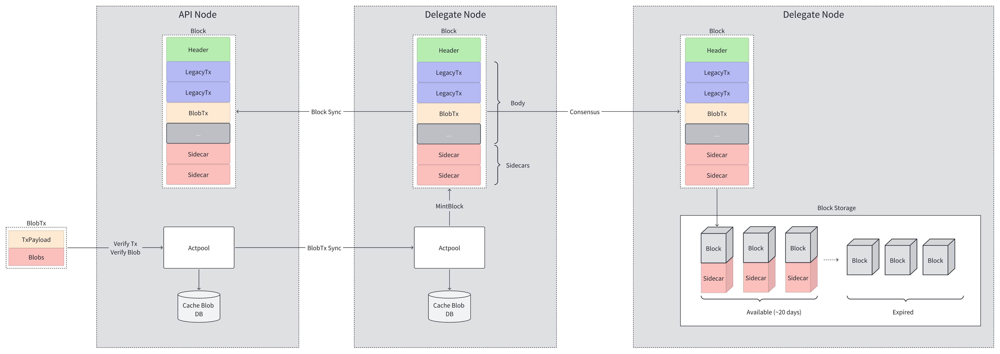

```
IIP: 36
Title: Enable Cancun Upgrade
Author: Chen Chen (chenchen@iotex.me)
Discussions-to: <URL>
Status: Draft
Type: Standards Track
Category Core
Created: 2024-08-08
```

## Abstract
This proposal outlines the activation of the Cancun upgrade of Ethereum on the IoTeX chain, encompassing the majority of Ethereum Improvement Proposals (EIPs). The primary feature of this upgrade is EIP-4844 Shard Blob Transactions, which introduces support for blob transactions, particularly benefiting ZK-type applications like w3bstream. Furthermore, the upgrade incorporates several new EIPs aimed at introducing additional EVM virtual machine instructions to facilitate compatibility with upgraded versions of the Solidity compiler.

## Motivation
First and foremost, staying abreast of the latest Ethereum upgrades is paramount. By aligning with the most recent Ethereum standards as an EVM-compatible chain, we can significantly improve the developer experience.
Furthermore, leveraging the capabilities of blob transactions as supported by EIP-4844 can drive seamless integration for ZK applications. Given the significant relationship between W3bstream and ZK within the IoTeX ecosystem, this integration holds immense importance.

## Specification
This upgrade is mainly based on Ethereum-related EIPs in Cancun upgrade.

### EIP-4844 On IoTeX L1
Ethereum's EIP-4844 is designed to reduce the costs of Layer 2. It mainly introduces a new transaction type: blob transactions. These transactions allow a maximum of 6 blobs, each with a fixed size of 128KB, represented by KZG polynomials. The blob data will only be stored in the Ethereum consensus layer for a fixed period of time (4906 Epochs, approximately 18.2 days for Ethereum). Implementing EIP-4844 on IoTeX is essentially similar to Ethereum, except for the fact that we do not have a consensus layer.

#### 1 - Overview
EIP-4844 mainly consists of three parts:
- Blob TX: Users can include up to 6 blobs in blob transactions, with each blob fixed at 128KB in size. Upon successful verification, these blobs will be added to the actpool. Once included in a block, these blobs will be retained for approximately 20 days
- BlobFee Market: Blobs have their own pricing mechanism, similar to EIP-1559, with dynamic base blob gas price.
- Precompile Contract: A point evaluation precompile is used to verify a KZG proof claiming that a blob evaluates a given value at a specific point.

Main Flow


#### 2 - Key Parameters
- Blob Size: 128KB, containing 4096 field elements of 32 bytes
- Blob Number Per Block: 
  - The number of blobs within a block is dynamic (ranging from 0-6), 3 blobs per block is the target
- Blob Gas Accounting:
  - GAS_PER_BLOB = 131072
  - MIN_BLOB_GASPRICE = 1(Rau/Wei)
  - In order to keep the number of blobs at 3, if it exceeds or decreases, the dynamic blob gas price will increase or decrease by up to ~12.5%
  - All blobs are 128KB even if they are not fully filled
- KZG Trusted Setup
  - The community of eth conducted a KZG Trusted Setup Ceremony to create the necessary cryptographic parameters, see https://ceremony.ethereum.org/
- Blob Expire Period
  - Blobs remain available for exactly 480 epochs (345,600 blocks), which is ~20 days, just longer than eth (~18.2 days)
  - Target blob storage: 3*128KB*345600: 127GB

#### 3 - Data Structure
##### A. New BlobTx
Three new elements:
- BlobFeeCap *big.Int
- BlobHashes []common.Hash
- BlobTxSidecar
  - Blobs []kzg4844.Blob
  - Commitments []kzg4844.Commitment
  - Proofs []kzg4844.Proof

The user needs to provide the corresponding BlobTxSidecar along with the transaction content when submitting the transaction. BlobTx without blob is invalid. But the sidecar will be pruned when the transaction is included in the block, and not contribute to hash calculating.

##### B. Block Header
There will have 2 new elements:
- BlobGasUsed: the total amount of blob gas consumed by the transactions within the block.
- ExcessBlobGas: total of blob gas consumed in excess of the target, prior to the block. Blocks with above-target blob gas consumption increase this value, blocks with below-target blob gas consumption decrease it (bounded at 0).

#### 4 - Blob Pool
Since each blob will be 128KB, which is significantly larger than normal transactions, we upgrade actpool to reduce the network traffic cost.
- Persistant Cache: blob tx will be cached in the database once it is accepted by actpool, which helps to avoid redownloading the blob tx
- Blob Tx Propagation: only broadcast blob tx hash, if the remote peer wants to get the content, reply blob tx with blobs

#### 5 - Blob Storage & Sync
Blobs in most recent 345,600 blocks must be available. 

We implement blob sync in a simple way, that sync blobs with blocks directly. It would be much more reliable for blob availability, since we make blocks and blobs are propagated as a unit; when there is a block, its unexpired blobs must exist as well.

The blob sync operation will be combined with block sync. The sync operation will get stuck if it can not get the desired blob, i.e. The blob is still alive (within 20 days), but the remote peer can not provide the desired blob. In this case, the node needs to reselect peer to sync.

#### 6 - Blob Gas Accounting
Blob Gas = len(blobs) * GAS_PER_BLOB
- GAS_PER_BLOB: The blob gas consumed by one blob

Blob Gas Price=MIN_BLOB_BASE_FEE * e^(excess_blob_gas / BLOB_BASE_FEE_UPDATE_FRACTION)
- MIN_BLOB_BASE_FEE: The minimum unit price for Blob gas is a fixed value of 1 wei.
- excess_blob_gas: The total amount of excess blob gas is the sum of the amount of blob gas consumed from the implementation of this EIP to date by each block compared to the "target blob gas amount," representing the cumulative value of the entire network.
- BLOB_BASE_FEE_UPDATE_FRACTION: The value is 3338477, which is the fractional value for updating the base fee of Blob, used to adjust transaction fees.

#### 7 - New Opcode and Precompile Contract
- 2 new opcodes: BLOBHASH (0x49) and BLOBBASEFEE (0x4a)
- 1 new precompile contract: point_evaluation_precompile

### EIP-1153: Transient storage opcodes
Two new opcodes are supported: TLOAD (0x5c) and TSTORE (0x5d)

### EIP-5656: MCOPY - Memory copying instruction
New opcode MCOPY (0x5e) is supported

### EIP-6780: SELFDESTRUCT only in same transaction
Behaviour changes on SELFDESTRUCT opcode, only preserved when is called in the same transaction a contract was created, otherwise it will only send balances in the account to the target.

### EIP-7516: BLOBBASEFEE opcode
New opcode BLOBBASEFEE (0x4a) is supported

## Rationale
### 4844 Param comparison with eth
In order to maintain compatibility with Ethereum, the parameters related to EIP-4844 are generally consistent with those of Ethereum, with the following exceptions:
- Blobs available period: We have set it to 20 days, while Ethereum has it at 18.2 days. The reason for this adjustment is due to the difference in block production speed between IoTeX and Ethereum. We made this adjustment to keep the period within a complete epoch. However, the duration is still longer than that of Ethereum.

### Together block and blobs
In our network transmission of blocks, we package blobs and blocks together for propagation, rather than separately. Although this may increase network data packet size, it ensures that nodes can always receive the corresponding blob for validation upon receiving a block within its validity period. 

If separate propagation is desired, a more complex mechanism needs to be designed to ensure that nodes can quickly access blob data shortly after receiving a block, so as not to miss the consensus period. We may explore optimization in this direction in the future.


## Backwards Compatibility
This proposal introduces a new transaction type, BlobTx, which is on par with the previous types legacyTx, accesslistTx, and dynamicFeeTx. A specific action(e.g. Transfer, Execution...) can be any one of these four types.

## Test Cases

## Implementation

## Copyright
Copyright and related rights waived via [CC0](https://creativecommons.org/publicdomain/zero/1.0/).