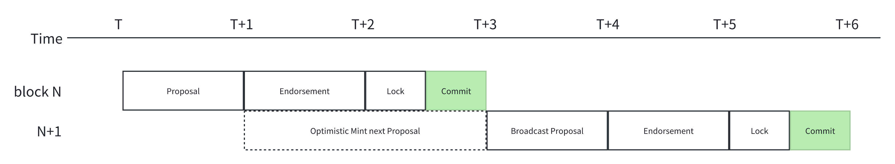
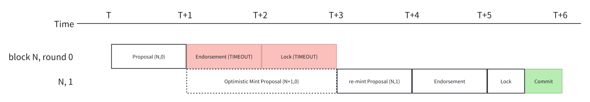

```
IIP: 42
Title: Reduce Block Interval to 2.5 Seconds for IoTeX L1
Author: Chen Chen (chenchen@iotex.io) Zhi (zhi@iotex.io) Raullen Chai (raullen@iotex.io)
Status: Draft
Type: Standards Track
Category: Core
Created: 2025-03-20
```

## Abstract

This proposal advocates reducing the block interval of the IoTeX blockchain from 5 seconds to 2.5 seconds through targeted consensus parameter optimization and network-layer enhancements. By shortening the block interval, the network aims to achieve lower latency for transaction finality, and improved user experience, particularly for latency-sensitive applications in DeFi and DePIN (Decentralized Physical Infrastructure Networks).

## Motivation

**High Latency Concerns**: The current 5-second block interval is suboptimal for applications requiring near-instant finality, such as gaming, DeFi arbitrage, and micropayments in DePIN ecosystems.

**Competitive Benchmarking**: Leading Layer-1 blockchains (e.g., Solana, Avalanche, BSC) and Layer-2 solutions (e.g., Polygon PoS) have adopted sub-3-second intervals, setting user expectations for faster confirmations. Retaining a 5-second interval risks ecosystem migration to faster chains.

**DePIN Requirements**: IoTeX's focus on machine-economy and DePIN applications necessitates faster transaction processing for device-to-device interactions and real-time data transmission scenarios.

## Specification

### Consensus Parameter Adjustments

**Block Interval Redistribution**

The consensus process in IoTeX's DPOS-like mechanism is divided into four stages: Propose, Endorsement, Lock, and Commit. Currently, the block interval is 5 seconds. We propose to reduce the processing time allocated to the each stage to lower the overall block interval to 2.5 seconds.
The time allocation will be modified as follows based our optimization and benchmarking:
- Propose stage: Reduced from 2 seconds to 0.8 second
- Endorsement stage: Remains at 0.8 second
- Lock stage: Reduced from 1 second to 0.45 seconds
- Commit stage: Reduced from 1 second to 0.45 seconds
- Total: 3 seconds

| Stage    | Propose    | Endorsement    | Lock    | Commit    |
|---|---|---|---|---|
| Functions   | Mint proposal and broadcast | Validate proposal and vote | Vote    | Commit to storage |
| TTL (5s)    | 2s    | 1s    | 1s    | 1s    |
| TTL (3s)    | 0.8s    | 0.8s    | 0.45s    | 0.45s    |

**Epoch Restructuring**

- Delegates: Fixed at 24.
- Sub-Epochs: Increased from 30 to 60 per epoch.
- Blocks per Epoch: Increased from 720 to 1,440 blocks, maintaining a 1-hour epoch duration (1,440 × 2.5s = 3,600s).

**Gas Limit Adjustment**

- Block Gas Limit: Reduced from 50M to 25M
- Effective Throughput: Maintained at 10M gas/second (25M ÷ 2.5s = 10M/s).

### Optimistic Block Minting

To ensure blocks can be produced reliably within the shorter time interval, we introduce an optimistic block minting mechanism:

- **Proactive Proposal Preparation**: Once receiving a valid proposal of current block (P1), the next proposer will start preparing the proposal for the next block (P2). When the next round starts, the pre-prepared P2 will be broadcasted right away. Consequently, delegates receiving P2 will have a longer time to validate the proposal.



- **Fallback Process**: If consensus fails in a certain round(N, 0), delegates discard the optimistic proposal(N+1, 0), and restart the next round(N, 1) within 1 second for proposal.



- **Max-Mint-Time**: The time limit for preparing the next proposal must not exceed 0.8 second, ensuring that the proposal can complete subsequent consensus stages within the allotted time frame.

By introducing optimistic minting, the actual total duration of the proposal stage and the endorsement stage now is 4 seconds, which is longer than the previous 3 seconds. This indicates that we have ensured adequate processing time while reducing the block interval, thereby maintaining network stability under high load.

### Reward Recalibration

To maintain the same token emission per epoch, the rewards to delegates will be adjusted as follows:
- Epoch Reward: Because the duration of an epoch is the same as before, the epoch reward won't be changed.
- Block Reward: The total block reward per epoch, 5,760 IOTX (8 IOTX/block * 720 block), will be evenly distributed to the 1,440 blocks. Such that the reward per block will be adjusted to$$8 * 720 / 1440 = 4$$IOTX.

### System Staking Changes

The reduction in block intervals has had a certain impact on the staking contracts. Since the staking duration in the system is recorded based on block numbers, this results in issues such as early withdrawal and a reduced maximum staking duration. To address these problems, we have made the following changes:

#### V1 Staking Contract - Add bucket types
Add three bucket types to re-enable 91 days staking:
- 10,000 IOTX , 3,144,960 blocks
- 100,000 IOTX, 3,144,960 blocks
- 1,000,000 IOTX, 3,144,960 blocks

#### V2 Staking Contract - Deprecate

- V2 staking will be deprecated in products(e.g. [Staking Portal](https://stake.iotex.io/) and [ioPay](https://iopay.me/))
- Existed Stakes are only allowed to withdraw or migrate to v3 contract, other invalid actions(i.e. Stake, Lock, Merge, Expand and Donate) will mute stakes (do not have votes anymore)
- Existed Stakes are allowed to unstake or migrate to v3 contract

#### Introduce V3 Staking Contract
To fundamentally address the issue of changes in the block interval causing the duration of old contracts to also change, we are introducing a v3 staking contract.

- **Timestamp Based Duration**: The main change in v3 is that the staking duration is calculated using natural timestamps instead of block numbers.
- **Legacy Migration**: Another feature is the support for migrating v2 buckets to v3, allowing for a one-to-one exchange.
  - Only the bucket owner, and only when it is in a locked state, can perform the migration.
  - The original bucket's owner is changed to the v3 contract address, while the voting rights are directed to a null address.
  - A v3 bucket will be generated owned by the staker, with the amount and delegate of the new bucket being the same as the original bucket, and the duration calculated based on the original bucket's duration multiplied by 5 seconds.

#### Native Migration
After the hard fork, the buckets generated by the native migration action will also be changed to the v3 contract.

### Rationale

#### Impacts on Legacy System Staking Contracts

In the [Quebec Upgrade](https://github.com/iotexproject/iotex-core/releases/tag/v1.11.0), we introduced the Staking Contract (v1: 0x68db92a6a78a39dcaff1745da9e89e230ef49d3d) to unlock liquidity staking. In the [Upernavik Upgrade](https://github.com/iotexproject/iotex-core/releases/tag/v2.0.0), we introduced the Native Staking Migration feature. Due to the limitations on staking types in the v1 contract, we also introduced the v2 contract (0x8ee521d2179576bcc4bd33a00904e96a11678052) to facilitate a smooth migration experience.

Currently, both versions are in use. The v1 version has been integrated into dapps such as uniIOTX, while the v2 version is only used by retail users.

Block interval reduction impacts these two staking contracts,  since the contract staking duration is determined based on the block number, and given that the block interval has been reduced to three seconds. The impacts are as follows:

- Early Withdrawal: for existing buckets, allowing unstaking to occur 50% earlier by natural time. 
- Voting Weight Reduction: the staking votes for the buckets are correspondingly reduced.
- Maximum Staking Duration Reduction:
  - v2: reduced from 36 months to around 18 months. 
  - v1: reduced from 91 days to 45.5 days

## Backward Compatibility

### 4.1 V1 Staking Contract (0x68db92a6a78a39dcaff1745da9e89e230ef49d3d)

The current v1 has a total staking volume of approximately 470 million IOTX, with the vast majority generated from uniIOTX. Therefore, we will retain the staking function for this version while offering a new staking type to correspond with the 91-day duration, to assist uniIOTX in migrating their original stake buckets. Once the migration is complete, we will close the original staking bucket type.

### 4.2 V2 Staking Contract (0x8ee521d2179576bcc4bd33a00904e96a11678052)

The current v2 has a total staking volume of approximately 10 million IOTX, primarily from individual stakers, making coordination more challenging. Therefore, the staking for this version will be deprecated, and any new staking or changes to the old staking will make the stakes invalid (no voting rights or staking rewards will be generated). 

For original stakers, there are two methods to handle their stakes:
- Migrate the stakes to the V3 staking contract (we provide a feature to directly convert V2 buckets to V3).
- Unstake and withdraw (withdrawal of the original stakes is allowed).

## Security Considerations

**Network Stability**

- The risk of increased consensus failures has been mitigated through the optimistic mint mechanism
- Comprehensive monitoring tools will be deployed to track consensus performance
- A rollback mechanism has been prepared in case of unexpected network behavior

**Delegate Requirements**

- Minimum hardware and bandwidth specifications for delegates will be updated to ensure reliable performance
- Monitoring systems will identify delegates who consistently lag in consensus participation

**Smart Contract Auditing**

- All modified contracts have undergone formal verification and comprehensive auditing and testing
- The v3 staking contract will be audited right away by [Independent Security Firm]
- Migration paths have been tested extensively to ensure data integrity during transitions

## Integrations and Rollout
This feature will be rolled out in v2.2.0, which is expected by the end of June, 2025. Before the release, it is necessary to complete the integration preparation for the related products, e.g., Staking Portal, ioPay, IoTeX Explorer, and third party products.

## Copyright

Copyright and related rights waived via [CC0](https://creativecommons.org/publicdomain/zero/1.0/).
