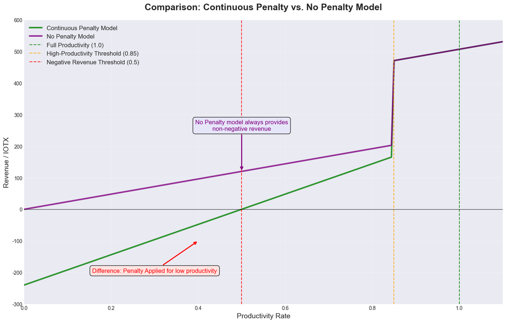

```
IIP: 50
Title: Slash Under-performed Delegates
Author: Chen Chen (chenchen@iotex.io) Zhi (zhi@iotex.io) Raullen Chai (raullen@iotex.io)
Status: Draft
Type: Standards Track
Category: Core
Created: 2025-07-02
```

## Abstract

Currently, IoTeX uses a probation system to exclude underperformed delegates from consensus participation for a period of time. While this mechanism helps maintain network quality, it lacks economic penalties that could further incentivize proper node maintenance. This proposal introduces a reasonable penalty on the staked principal of delegates who fail to meet consensus participation requirements, creating stronger economic incentives for delegates to maintain reliable infrastructure.

## Motivation

The current probation mechanism effectively removes underperforming delegates from consensus, but has several limitations:

1. Lack of Economic Consequences: Delegates only lose potential rewards during probation, but their staked principal remains untouched, reducing the economic pressure to maintain reliable infrastructure.
2. Insufficient Deterrent Effect: The current penalty (missing rewards) may not be significant enough to motivate delegates to invest in robust infrastructure and proper monitoring.
3. Network Reliability Concerns: Repeated failures without meaningful economic penalties may lead to complacency among delegates, potentially affecting overall network security and reliability.
4. Voter Protection: Token holders who stake with unreliable delegates currently bear the opportunity cost without the delegate facing proportional consequences.

By introducing a reasonable staking penalty, we can:
- Create stronger economic incentives for reliable operation
- Better align delegate and staker interests
- Improve overall network reliability and security
- Maintain a balanced approach that doesn't overly penalize occasional technical issues

## Specification

### Penalty Conditions and Calculation
- Trigger: A delegate receives a penalty if their block production productivity for the epoch is below the under_productivity_threshold.
- Penalty Amount: The penalty is calculated as block_reward * numberOfBlocksMissed.
- Deduction: The penalty amount is deducted from the delegate's self-stake. If the delegate is endorsed by another party, the penalty is deducted from the corresponding endorsement stake bucket.
- Distribution: Deducted amounts are transferred to the rewarding pool as one source of protocol revenues.
- Settlement: Penalties are settled when processing the GrantEpochReward system action, which occurs in the last block of each epoch.

### Delegate Disqualification and Recovery
- Insufficient Self-Stake: If a delegate's self-stake falls below the delegate_disqualification_threshold due to penalties, they will be disqualified from serving as a delegate and will not be included in the consensus group for subsequent epochs.
- Recovery: To regain delegate status, the operator must deposit additional funds to raise their self-stake back to at least the delegate_min_stake_amount.

### Slash Flow
1. SLA Violation: Delegate X fails to produce N blocks in epoch E, where N exceeds the allowed number of missed blocks (i.e., productivity < under_productivity_threshold). This violation simultaneously triggers:
  - Existing probation mechanism: Delegate enters probation for 6 epochs as per current policy
  - New slash: Economic penalty applied as described in the following steps
2. Penalty Application (Epoch E): During the GrantEpochReward action in the last block of epoch E:
  - The calculated penalty is subtracted from the delegate's self-stake (or endorsement bucket) and added to the rewarding pool.
  - The delegate's total votes are reduced accordingly.
  - If the delegate's self-stake drops below the delegate_disqualification_threshold, their status is marked as invalid.
3. Removal from Delegate List (Epoch E+1): During the PutPollResult action (at the mid-point of epoch E+1):
  - Any delegate marked as invalid is excluded from the active delegate list.
4. Exclusion from Consensus (Epoch E+2): Delegate X is fully excluded from the consensus delegate set starting from epoch E+2.

### Delegate Recovery Flow
1. Stake Restoration (Epoch F): The operator submits a DepositToStake action to increase their self-stake to at least the delegate_min_stake_amount.
  - The self-stake amount and corresponding votes are increased.
  - The delegate's status is marked as valid again.
2. Re-inclusion in Delegate List (Epoch G): During the next PutPollResult action (in epoch F or F+1):
  - The delegate, now marked as valid, is included in the active delegate list.
3. Resumption of Consensus (Epoch G+1): Delegate X is eligible to be part of the consensus delegate set starting from epoch G+1.

### Parameters
The following table lists the key parameters and thresholds used in this proposal which are subjected to adjustment via future IIPs:

| Parameter | Value | Description |
|-----------|-------|-------------|
| under_productivity_threshold | 0.85 (85%) | Minimum productivity rate required to avoid penalties. We deliberately choose 85% as the initial threshold to provide a gradual introduction of the penalty mechanism. This threshold is expected to increase in future upgrades as the network matures and delegate infrastructure improves. |
| block_reward | 4 IOTX | Reward per block used in penalty calculation |
| delegate_min_stake_amount | 1,200,000 IOTX | Minimum self-stake required for initial qualification and recovery after disqualification |
| delegate_disqualification_threshold | 1,000,000 IOTX | Self-stake threshold below which a delegate loses qualification |

## Rationale

### Delegate Revenue and Productivity
This penalty mechanism is designed to create a sharp economic disincentive for failing to meet the minimum productivity threshold. The following analysis illustrates the financial impact.

**Parameters:**
- avg_priority_fee = 0 (for simplicity)
- sub_epoch_nums = 60 (number of blocks per sub-epoch)
- avg_epoch_reward = 267 IOTX (based on an approximation of 18,750 IOTX distributed among ~70 delegates on the IoTeX Mainnet)

**Revenue Calculation:**
Let R be the total revenue and P be the productivity rate.
- If P >= under_productivity_threshold (No Penalty):
R = (block_reward + avg_priority_fee) * sub_epoch_nums * P + avg_epoch_reward
The delegate earns rewards proportional to their productivity.
- If P < under_productivity_threshold (Penalty Applied):
R = (block_reward + avg_priority_fee) * sub_epoch_nums * P - (block_reward) * sub_epoch_nums * (1 - P)
The delegate's revenue from block production is offset by a penalty calculated from the blocks they failed to produce.

The formula creates a "cliff" at the under_productivity_threshold mark. As shown in the chart below, revenue drops significantly once a delegate's productivity falls below this threshold, making it economically irrational to operate an unreliable node.



### Comparison with ETH2 Slashing Mechanism
This proposal draws inspiration from Ethereum 2.0's incentive system while adapting to IoTeX's unique consensus architecture:

**ETH2 System Overview:**

ETH2 employs a comprehensive three-tier penalty system:
1. Slashing (severe): Cryptographic proof of protocol violations (double signing, conflicting attestations)
2. Inactivity penalties (network-wide): Quadratic penalties during finality failures
3. Regular penalties (individual): Missed attestations and duties
This proposal specifically targets scenarios similar to ETH2's regular penalties, focusing on operational reliability rather than protocol attacks. Future proposals may introduce additional penalty mechanisms for other types of misbehavior.

**Regular Penalties Comparison (Most Relevant):**

| Aspect | ETH2 Regular Penalties | IoTeX IIP-50 |
|--------|------------------------|---------------|
| Trigger Mechanism | Individual missed duties (attestations, proposals) | Productivity below 85% threshold |
| Calculation Method | Balance-proportional penalty per missed duty | block_reward * numberOfBlocksMissed |
| Recovery Model | Immediate - no lasting effects | Immediate - cause delegate disqualification |

## Backward Compatibility
This proposal is NOT backwards compatible and requires a hard fork. The changes break a few invariants:
- Self-stake can only increase or be withdrawn completely: Once penalized, self-stake will be deducted by small amounts automatically by the system.
- Delegates are probated only for a period of epochs: Once self-stake becomes insufficient, the delegate will be marked as invalid indefinitely, until they restake enough funds to meet the minimum threshold.

## Security Considerations
### Penalty Parameter Security
The penalty calculation relies on existing productivity metrics and block reward values. The following considerations ensure secure penalty application:
- Productivity Threshold Manipulation: The under_productivity_threshold is based on existing network parameters and cannot be manipulated by individual delegates. Productivity is calculated objectively based on actual block production.
- Penalty Amount Bounds: Penalties are bounded by the block_reward * numberOfBlocksMissed formula, preventing excessive punishment that could destabilize the network or create perverse incentives.
- Self-Stake Protection: The minimum self-stake threshold (delegate_disqualification_threshold) and recovery threshold (delegate_min_stake_amount) provide reasonable buffers to prevent accidental disqualification due to minor productivity issues.
### Economic Attack Vectors
Several economic attack scenarios must be considered:
- Griefing Attacks: Malicious actors cannot directly trigger penalties on other delegates, as penalties are based on objective productivity measurements that each delegate controls through their own infrastructure.
- Self-Inflicted Penalties: A delegate could intentionally underperform to trigger penalties, but this would only harm themselves economically and operationally, providing no benefit to the attacker.
- Coordination Attacks: Multiple delegates coordinating to underperform would face collective penalties, making such attacks economically irrational and self-defeating.
### Network-Wide Events and Resilience
Network-wide disruptions will not cause disproportionate penalties for individual delegates. When the entire network experiences issues (such as consensus failures affecting all nodes during a sub-epoch), individual delegate productivity rates remain relatively unaffected since the impact is distributed across all participants. The penalty mechanism is designed to target individual delegate performance issues rather than systemic network problems.

## Copyright

Copyright and related rights waived via [CC0](https://creativecommons.org/publicdomain/zero/1.0/).
