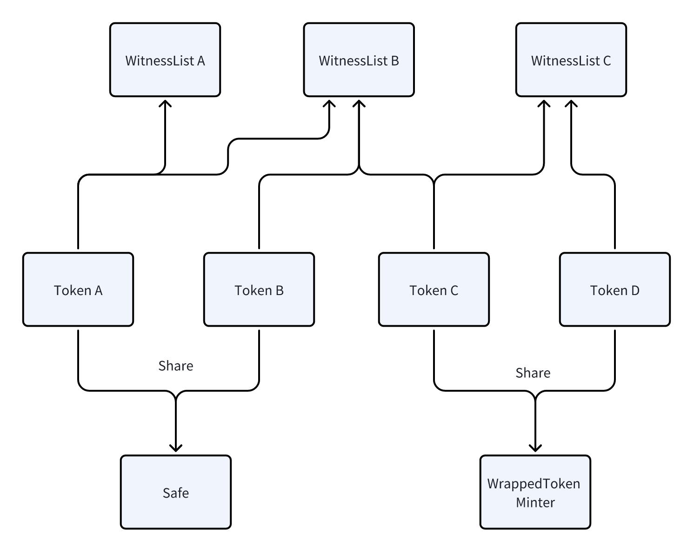

```
IIP: 55
Title: Dynamic Witness Committee for ioTube
Author: Haixiang (haixiang@iotex.io) Zhi (zhi@iotex.io)
Status: Draft
Type: Standards Track
Category: ioTube
Created: 2025-12-08
```
## Abstract

This proposal introduces a **Dynamic Witness Committee** mechanism for ioTube, the cross-chain bridge for the IoTeX ecosystem. Instead of a static list of witnesses validating all transfers indefinitely, a **Witness Manager** contract selects a subset of witnesses (the "Committee") from a larger pool of candidates for each "epoch" and rotates them over time. The proposal also upgrades the validator contract to **TransferValidatorV3** and introduces **per-token witness sets**, so that each bridged asset can use an appropriate set of witnesses and security parameters while preserving a simple user experience.

## Motivation

In the current ioTube bridge, a **static global witness list** and a single validator are used for all tokens and chains, requiring **>2/3** of all witnesses to sign every transfer. While functional, this architecture shows clear limitations as IoTeX and the broader ecosystem scale: no automatic key rotation when witnesses are compromised, identical security assumptions for both small and large assets, increasing operational costs as the witness set grows, and manual, centralized updates to the witness list.

Over the next 6–18 months, the IoTeX ecosystem expects significant growth across stablecoins, RWA assets, and cross-chain value flows. At the same time, **millions of AI and RWAI agents** will begin operating autonomously across multiple chains, requiring reliable, scalable, and self-governing cross-chain infrastructure to move data and value. To support this environment, ioTube must evolve functionally, governance-wise, scale-wise, and security-wise.

**IIP-55** addresses these needs by introducing a **rotating committee of IoTeX delegates** (selected via a Roll-DPoS–style process), **per-token witness and minter mappings**, and **rules-based on-chain management** of witness membership — while retaining the familiar **>2/3** multi-witness validation threshold. This ensures ioTube is prepared for the next phase of cross-chain activity, both for human users and for large-scale autonomous agent systems.

## Specification

The upgrade introduces several new components and flows to the ioTube architecture.

### Terminology

-   **Witness**: A node that observes bridge activity and signs messages authorizing cross-chain transfers or witness-list updates.
-   **Candidate**: A witness that is eligible to be selected into a future committee.
-   **Committee**: The active subset of witnesses for a given epoch that must co-sign operations (e.g., bridge transfers, witness-list updates).
-   **Epoch**: A period (defined in blocks or time) during which a particular committee is active.
-   **Relayer**: A service that collects signed data from witnesses and submits transactions to destination chains.
-   **Witness List**: An on-chain contract that tracks which witness addresses are currently active.
-   **Witness Manager**: An on-chain contract that manages epochs and updates the witness list according to rules defined in this proposal.
-   **Transfer Validator**: An on-chain contract that verifies witness signatures for bridge transfers and mints or releases tokens.

### 1. Witness Selection and Committee Lifecycle

This mechanism explains **who the witnesses are**, **how the committee is formed and rotated**, and **how on-chain contracts enforce the rules**.

-   **Who are the witnesses?**  
    The witness committee is composed of existing IoTeX **delegates** who already participate in IoTeX’s Randomized Delegated Proof of Stake (Roll-DPoS) consensus. Delegates can opt in to also serve as ioTube witnesses, so a single operator both produces L1 blocks on IoTeX and signs bridge operations for ioTube.

-   **Candidate pool and committee formation (Roll-DPoS style)**  
    IoTeX token holders vote for delegates, forming a candidate set (at least 36 delegates per epoch). From this pool:
    -   A smaller random committee (e.g., 8 delegates) is selected for each epoch using VRF-based randomness, similar to Roll-DPoS. The randomness is publicly verifiable and prevents any single party from biasing the selection.
    -   The resulting committee is encoded as **witnesses to add** and **witnesses to remove** compared to the current committee.

-   **Off-chain witness committee service and relayers**  
    A witness committee service:
    -   Reads the current epoch and active witnesses from `WitnessManager` and `WitnessListV3`.
    -   Computes the next committee using the process above.
    -   Submits the proposed update to relayers.

-   **On-chain enforcement (WitnessManager + WitnessListV3)**  
    When `proposeWitnesses` is called:
    -   `nextEpochNum` must equal the current epoch plus a fixed interval.
    -   `witnessesToAdd` / `witnessesToRemove` are sorted deterministic lists.
    -   Signatures are checked against the current active witnesses in `WitnessListV3`.
    -   The number of unique valid signatures must be **> 2/3** of the current active witnesses.  
    If the proposal passes:
    -   `WitnessListV3` is updated by adding/removing addresses.
    -   The epoch number is advanced.
    -   Events are emitted so explorers and monitoring tools can track committee changes.

From a user perspective, this entire lifecycle is invisible: the bridge continues to work, while the set of witnesses securing it is periodically refreshed using the same decentralized delegate base as IoTeX L1.

### 2. Per-token Witness and Minter Mapping



This mechanism explains **how each bridged token chooses its own security settings and minting logic**, using `TransferValidatorV3`.

-   **Per-token configuration**  
    For every token supported by ioTube, there is a simple configuration that says:
    -   **Which contract mints or unlocks this token** on the destination chain (the token’s minter).
    -   **Which witness group(s) must sign** transfers of this token (one or more witness lists).

-   **Different security levels for different tokens**  
    -   A small-cap token can share a common witness group and minter with other assets.  
    -   A high-value or governance token can be mapped to its **own** witness group (or multiple groups) and to a dedicated minter, giving it stricter, more isolated security without affecting other tokens.

-   **How a transfer is validated with this mapping**  
    When a transfer of token *X* is ready to be settled:
    -   Relayers look up token *X*’s configuration and collect signatures from the required witness group(s).  
    -   `TransferValidatorV3`:
        -   Verifies that **> 2/3** of the active witnesses in each required group have signed the transfer data.
        -   Calls the configured minter for token *X* to mint or release the correct amount to the user.
        -   Emits an event including the token, amount, recipient, and the witnesses that signed.
        -   If the recipient is a registered smart contract, calls `onReceive` so dApps can hook custom logic (e.g., swaps or auto-staking) into the bridge.

In current deployments, the bridge uses `TransferValidatorWithPayload` with a single global witness list. `TransferValidatorV3` keeps the same high-level flow but allows this **per-token configuration**, and is intended to gradually replace `TransferValidatorWithPayload` in production as tokens migrate.

### 3. Economics and Governance for Token Support

This section outlines the incentives for witnesses and the process for expanding token support.

-   **Delegate Execution (Opt-in)**  
    Delegates individually configure their nodes to support a specific token. The bridge only becomes operational for that token once a sufficient witness threshold (>2/3) is actively signing its transactions.

-   **Incentives**  
    Delegates are motivated to support assets by:
    -   **Ecosystem Growth**: Bridging high-demand assets increases network utility and delegate reputation.
    -   **Future Revenue**: The system architecture supports future implementation of fee-sharing mechanisms, distributing bridge fees to active witnesses based on on-chain participation.

### 4. Bridge Flow Overview (User Perspective)

Putting the mechanisms together, a typical cross-chain transfer works as follows:

1.  **Lock / burn on source chain**  
    The user sends tokens to an ioTube cashier contract (or equivalent) on the source chain.

2.  **Observation by witnesses**  
    Witness nodes (IoTeX delegates serving as witnesses) monitor IoTeX and external chains, detect valid bridge events, and record them via the witness service.

3.  **Committee signatures**  
    Active committee members for the token’s witness list(s) sign the transfer data.

4.  **Relayer aggregation and submission**  
    Relayers aggregate signatures and call `TransferValidatorV3` on the destination chain with the transfer data and signatures.

5.  **On-chain validation and minting**  
    `TransferValidatorV3` verifies signatures against the current witness sets and enforces the > 2/3 thresholds. If everything is valid, it mints or releases the bridged tokens to the user’s address and emits a `Settled` event.

6.  **Optional application logic**  
    If the recipient is a smart contract registered as a receiver, the validator calls `onReceive`, enabling cross-chain swaps, protocol-native auto-staking, or other higher-level behaviors.


## Rationale

This section explains **why** the mechanisms in the Specification are chosen.

-   **Witness Selection and Committee Lifecycle**  
    -   Rotating committees of IoTeX delegates reduce the attack surface compared to a static global witness list and let the operator set evolve over time without downtime.  
    -   Reusing the Roll-DPoS delegate base and > 2/3 supermajority threshold aligns the bridge’s security model with IoTeX L1, making it easier for the community to reason about and monitor.

-   **Per-token Witness and Minter Mapping**  
    -   Different tokens have different risk profiles; per-token witness and minter mapping lets high-value or governance-critical assets choose stricter security (e.g., dedicated witness sets) without slowing down the entire bridge.  

-   **Economics and Governance**  
    -   **Delegate Autonomy**: Delegates manage their own risk and infrastructure costs by choosing which assets to support, acting as a final security check for new assets.

## Backwards Compatibility

This is a **breaking change** for how witness membership is managed and how witness verification is performed, but it is designed to be **compatible at the token level**.

-   **New contracts**:
    -   `WitnessManager` and `WitnessListV3` manage committees and witness membership.
    -   `TransferValidatorV3` replaces or complements previous validator contracts for new deployments.
-   **Existing tokens and minters**:
    -   Existing minter contracts can be associated with `TransferValidatorV3` via the new token-to-minter mapping.
    -   Token contracts themselves do not need to change; only their bridge configuration (which validator and witness lists they use) is updated.
-   **Coexistence with existing validators**:
    -   In the transition phase, `TransferValidatorWithPayload` and `TransferValidatorV3` can run **in parallel**.
    -   Frontends and backends can gradually migrate liquidity and traffic from `TransferValidatorWithPayload` to `TransferValidatorV3`.
    -   Once the ecosystem has migrated, `TransferValidatorWithPayload` can be paused or fully deprecated.

From a user perspective, deposit and withdrawal flows remain the same; only the underlying security model and configuration become more robust and flexible.

## Copyright

Copyright and related rights waived via [CC0](https://creativecommons.org/publicdomain/zero/1.0/).
