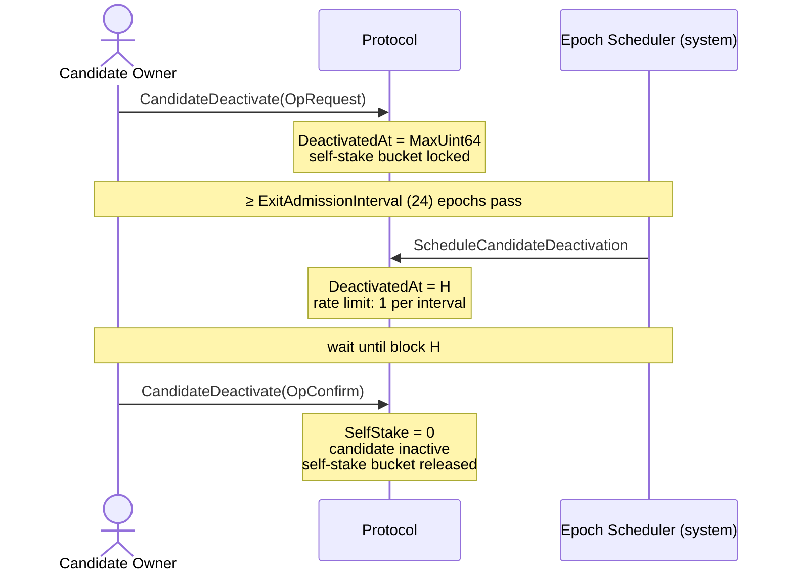

```
IIP: 61
Title: Candidate Exit Queue
Author: Zhi (zhi@iotex.io), ChenChen (chenchen@iotex.me)
Status: Draft
Type: Standards Track
Category: Core
Created: 2026-01-21
```

## Abstract

This proposal introduces a queue-based exit mechanism for IoTeX validator candidates. Rather than allowing immediate deactivation, a candidate must go through a three-stage process — Request, Schedule, and Confirm — before it can fully exit. The protocol rate-limits exits to at most one candidate per `ExitAdmissionInterval` epochs (default: 24 epochs), ensuring the network has advance visibility of upcoming validator exits and preventing sudden simultaneous stake withdrawals.

## Motivation

Under the previous model, a candidate could exit by directly unstaking its self-stake bucket via the `Unstake` action. This immediately set `SelfStake` to zero, causing the candidate to lose its self-stake and become inactive in the same block the transaction was included. This created two risks:

1. **Network instability**: Multiple delegates could exit simultaneously, causing abrupt drops in active validator count and degrading consensus participation without warning.
2. **Stake withdrawal surprise**: Sudden large self-stake withdrawals could affect vote-weight rankings and catch delegators off guard with no advance notice.

This IIP introduces `CandidateDeactivate`, a new action type that replaces the direct-unstake exit path with a queue-based mechanism. Exits are rate-limited to at most one candidate per `ExitAdmissionInterval` epochs, giving the network bounded, predictable exit throughput. The self-stake bucket is locked from the moment the exit is requested until confirmation, so delegators have a guaranteed notice window before the candidate's stake is released.

## Specification

### New Action Types

#### `CandidateDeactivate`

A new action type introduced by this IIP. It replaces the previous direct-unstake exit path and uses an `op` field to distinguish the request and confirm stages.

| Field | Type | Description |
|-------|------|-------------|
| `op` | uint32 | `0` = OpRequest, `1` = OpConfirm |

**Intrinsic gas**: 10,000

**ABI methods**:
- `requestCandidateDeactivation()` — OpRequest
- `confirmCandidateDeactivation()` — OpConfirm

#### `ScheduleCandidateDeactivation`

A zero-gas system action generated by the protocol at epoch boundaries. It is not submittable by users.

| Field | Type | Description |
|-------|------|-------------|
| `delegate` | address | Identifier address of the candidate to schedule |

**Intrinsic gas**: 0

### Candidate State Field: `DeactivatedAt`

A new `DeactivatedAt` field is added to the candidate record:

| Value | Meaning |
|-------|---------|
| `0` | No exit requested |
| `MaxUint64` | Exit requested, awaiting scheduling |
| `H` (block height) | Scheduled; candidate may confirm at or after block `H` |

### Exit Lifecycle

The exit process involves three parties: the candidate owner (who initiates and confirms), the protocol (which enforces state transitions), and the epoch scheduler (a system actor that rate-limits scheduling at epoch boundaries).



#### Stage 1 — Request

Triggered by: Candidate owner calls `CandidateDeactivate(OpRequest)`.

Preconditions:
- Caller is the candidate owner.
- Candidate has a self-stake bucket (`SelfStakeBucketIdx != MaxUint64`).
- `DeactivatedAt == 0` (no pending exit).

State changes:
- `DeactivatedAt` is set to `MaxUint64` (sentinel for "requested, not yet scheduled").
- The self-stake bucket is locked; it cannot be unstaked until confirmation.
- Emits `CandidateDeactivationRequestedEvent`.

#### Stage 2 — Schedule (system)

Triggered by: Protocol-generated `ScheduleCandidateDeactivation` at each epoch-start block.

Rate limit: At most one candidate is admitted per `ExitAdmissionInterval` epochs. The protocol stores `_lastExitEpoch` in state; if `currentEpoch < _lastExitEpoch + ExitAdmissionInterval`, no scheduling occurs this epoch.

When a candidate is admitted:

```
DeactivatedAt = blockHeight + ExitAdmissionInterval × NumBlocksPerEpoch(currentEpoch)
```

State changes:
- `DeactivatedAt` updated to the computed future height.
- `_lastExitEpoch` updated to `currentEpoch`.
- Emits `CandidateDeactivationScheduledEvent(identifier, scheduledHeight)`.

The self-stake bucket remains locked.

#### Stage 3 — Confirm

Triggered by: Candidate owner calls `CandidateDeactivate(OpConfirm)`.

Preconditions:
- `DeactivatedAt != 0` and `DeactivatedAt != MaxUint64` (i.e., scheduled).
- `currentBlockHeight >= DeactivatedAt`.
- Caller is the candidate owner.

State changes:
- `SelfStake` set to 0.
- `SelfStakeBucketIdx` set to `MaxUint64` (cleared).
- Vote weight recalculated without the self-stake multiplier.
- Candidate becomes inactive.
- The former self-stake bucket is converted to a regular vote bucket and becomes withdrawable.
- Emits `CandidateDeactivatedEvent`.

### Parameters

| Parameter | Value | Description |
|-----------|-------|-------------|
| `ExitAdmissionInterval` | 24 epochs | Minimum epochs between two scheduled exits |
| `CandidateDeactivateBaseIntrinsicGas` | 10,000 | Gas for both OpRequest and OpConfirm |

### Validation Rules

| Condition | Error |
|-----------|-------|
| Feature disabled (`NoCandidateExitQueue = true`) | Action rejected |
| `DeactivatedAt != 0` on OpRequest | `ErrExitAlreadyRequested` |
| `DeactivatedAt == 0` on OpConfirm | `ErrExitNotRequested` |
| `DeactivatedAt == MaxUint64` on OpConfirm | `ErrExitNotScheduled` |
| `currentHeight < DeactivatedAt` on OpConfirm | `ErrExitNotReady` |
| Unstake attempt while exit pending | Rejected with `ErrUnstakeBeforeMaturity` |

### Feature Activation

This feature is gated by the `NoCandidateExitQueue` feature flag. When `NoCandidateExitQueue = false` (i.e., the flag is cleared), the exit queue is active. This flag is cleared at `YapBlockHeight`.

## Rationale

### Rate Limiting at the Epoch Boundary

Scanning for pending exits and admitting at most one per `ExitAdmissionInterval` ensures a bounded, predictable exit rate. Doing this at the epoch boundary (rather than per block) aligns with the existing epoch-based staking and election mechanics.

### Using `MaxUint64` as the Pending Sentinel

`DeactivatedAt = MaxUint64` cleanly distinguishes "requested but not scheduled" from both "not requested" (0) and "scheduled at a specific height" (any concrete block number). This avoids a separate boolean field and keeps state changes atomic.

### Request Is Non-Cancellable

Once an exit is requested, it cannot be cancelled. This prevents griefing patterns where a candidate repeatedly requests and cancels exits to manipulate network perception or trigger scheduling slots for other actors. It also simplifies the state machine.

### Locking the Self-Stake Bucket

Locking the self-stake bucket from request through confirmation prevents a candidate from requesting exit while simultaneously withdrawing self-stake, which would undermine the notice period's purpose. After confirmation, the bucket reverts to a regular vote bucket and is subject to normal withdrawal rules.

## Backwards Compatibility

This IIP is NOT backwards compatible and requires a hard fork (activated at `YapBlockHeight`).

Breaking changes:

1. **`CandidateDeactivate` semantics changed**: The action now requires the new `op` field. Clients that issue `CandidateDeactivate` without specifying `op` will default to `OpRequest`; immediate deactivation is no longer possible.

2. **New system action**: `ScheduleCandidateDeactivation` is a new action type not present in previous protocol versions. Nodes running older software will not recognize it.

3. **Candidate state schema change**: The `DeactivatedAt` field is added to the candidate record. Older nodes cannot interpret the updated state layout.

4. **Self-stake bucket locking**: Any candidate that has called `CandidateDeactivate(OpRequest)` will have its self-stake bucket locked until confirmation. This is a new constraint not present previously.

## Security Considerations

- **Griefing via queue starvation**: An adversary cannot occupy all queue slots indefinitely because the rate limit is one per `ExitAdmissionInterval` epochs and the request is non-cancellable — each slot is consumed by a genuine exit.
- **No front-running risk**: The schedule timing (`DeactivatedAt`) is deterministic and set by the protocol, not by the user, so there is no advantage in ordering or timing the confirm transaction.
- **Self-stake manipulation**: The locking mechanism prevents withdrawing self-stake during the notice period, ensuring the candidate's economic commitment remains visible to delegators throughout the exit process.

## Test Cases

Test cases will be implemented in the `e2etest/` package of iotex-core, covering:

1. Happy-path: Request → Schedule → Confirm across epoch boundaries.
2. Rate limit enforcement: Two candidates request exit in the same epoch; only one is scheduled per `ExitAdmissionInterval`.
3. Unstake rejected while exit pending.
4. OpConfirm rejected before `DeactivatedAt` is reached.
5. Duplicate request rejected with `ErrExitAlreadyRequested`.
6. Feature flag: All deactivation actions rejected when `NoCandidateExitQueue = true`.

## Copyright

Copyright and related rights waived via [CC0](https://creativecommons.org/publicdomain/zero/1.0/).
